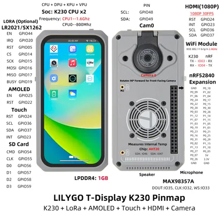

# T-Display K230 Cased Version

**LILYGO** · K230 with ESP32 companion

Revision: Not identified  
Coverage: Pinout image collected

[Browse all manufacturers](../../../../BROWSE.md) · [Devices & IoT](../../../../DEVICES.md) · [Open in the browser guide](https://valleytech-black-wire-guide.pages.dev/?board=lilygo-other-t-display-k230-cased-version)

Device category: **Displays & HMI**

## Board pin map

**pinout image** · Reviewed source · JPG

[Open original reference](../../../../library/media/6a3afc2e0bf16625a61efbc046e924e401e56cb475e248851382634b4d8184dd.jpg)

**Credit and rights:** Not established; source attribution retained. Source/manufacturer: LILYGO.

[Source 1](https://wiki.lilygo.cc/products/t-display-series/t-display-k230/cased-version/image/t-display-k230-cased-pinmap.jpg) · [Source 2](https://wiki.lilygo.cc/products/t-display-series/t-display-k230/cased-version.html)

Manufacturer image preserved. Match the depicted board and revision before use.

Image revision: Not identified

SHA-256: `6a3afc2e0bf16625a61efbc046e924e401e56cb475e248851382634b4d8184dd`

Pin assignments have not been independently electrically verified. Check board revision before wiring.
