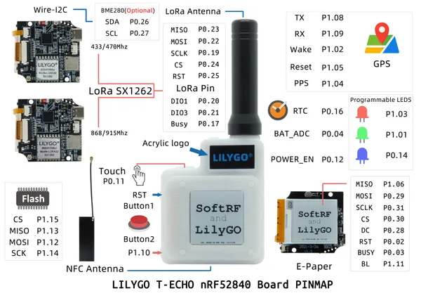
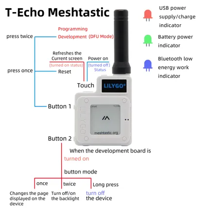

# T-Echo

**LILYGO** · nRF52840

Revision: Not identified  
Coverage: GPIO reference collected; physical pinout needed

[Browse all manufacturers](../../../../BROWSE.md) · [Devices & IoT](../../../../DEVICES.md) · [Open in the browser guide](https://valleytech-black-wire-guide.pages.dev/?board=lilygo-gpio-device-t-echo)

Device category: **Radios & GNSS**

## T-ECHO

**GPIO reference image** · Reviewed source · JPG

[Open original reference](../../../../library/media/0270eae4ae1784cb40c53bc0016903716e260699d9c3942df2c73c046c7e43ef.jpg)

**Credit and rights:** Not established; source attribution retained. Source/manufacturer: LILYGO.

[Source 1](https://raw.githubusercontent.com/Xinyuan-LilyGO/T-Echo/9de74b0dd86bb2793b5dfd26c35341f8ffaaa0b1/image/T-ECHO.jpg) · [Source 2](https://github.com/Xinyuan-LilyGO/T-Echo/blob/9de74b0dd86bb2793b5dfd26c35341f8ffaaa0b1/image/T-ECHO.jpg)

Original manufacturer diagram. Shown module, radio, display and power-system options must match the board. Internal peripheral GPIO assignments; not a complete exposed-pad map.

Image revision: Not identified

SHA-256: `0270eae4ae1784cb40c53bc0016903716e260699d9c3942df2c73c046c7e43ef`

## T-ECHO_Mesh

**board labeling image** · Reviewed source · JPG

[Open original reference](../../../../library/media/c1cbb2eb12f8308de91137cde63b6cd43f025c0a8155e2b48d3ade97ac73e4af.jpg)

**Credit and rights:** Not established; source attribution retained. Source/manufacturer: LILYGO.

[Source 1](https://raw.githubusercontent.com/Xinyuan-LilyGO/T-Echo/9de74b0dd86bb2793b5dfd26c35341f8ffaaa0b1/image/T-ECHO_Mesh.jpg) · [Source 2](https://github.com/Xinyuan-LilyGO/T-Echo/blob/9de74b0dd86bb2793b5dfd26c35341f8ffaaa0b1/image/T-ECHO_Mesh.jpg)

Original manufacturer diagram. Shown module, radio, display and power-system options must match the board.

Image revision: Not identified

SHA-256: `c1cbb2eb12f8308de91137cde63b6cd43f025c0a8155e2b48d3ade97ac73e4af`

Pin assignments have not been independently electrically verified. Check board revision before wiring.
