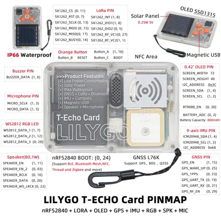

# T-Echo Card

**LILYGO** · nRF52840

Revision: Not identified  
Coverage: Pinout image collected

[Browse all manufacturers](../../../../BROWSE.md) · [Desktop app](https://github.com/valleytechsolutions/black-wire-desktop)

## Board pin map

**pinout image** · Reviewed source · JPG

[Open original reference](../../../../library/media/67138ea02cfa3062b89a09057881c75027de5cc787032ebef9edbdb9b258e13f.jpg)

**Credit and rights:** Not established; source attribution retained. Source/manufacturer: LILYGO.

[Source 1](https://wiki.lilygo.cc/products/t-echo-series/t-echo-card/index/image/t-echo-card-pinout.jpg) · [Source 2](https://wiki.lilygo.cc/products/t-echo-series/t-echo-card/)

Manufacturer image preserved. Match the depicted board and revision before use.

SHA-256: `67138ea02cfa3062b89a09057881c75027de5cc787032ebef9edbdb9b258e13f`

Pin assignments have not been independently electrically verified. Check board revision before wiring.
