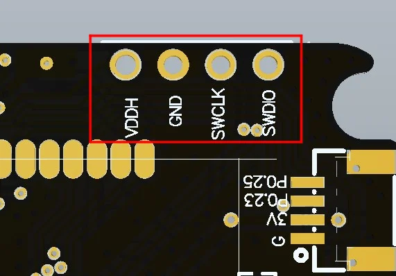

# T-Echo Lite

**LILYGO** · nRF52840

Revision: Not identified  
Coverage: Pinout image collected

[Browse all manufacturers](../../../../BROWSE.md) · [Devices & IoT](../../../../DEVICES.md) · [Open in the browser guide](https://valleytech-black-wire-guide.pages.dev/?board=lilygo-gpio-device-t-echo-lite)

Device category: **Radios & GNSS**

## SWD debug pads and nearby connector pins

**pinout image** · Reviewed source · JPG

[Open original reference](../../../../library/media/f902d7b853c846fe0acb437718a8987042fdca8cd56581a1afb64c3fff83c404.jpg)

**Credit and rights:** Not established; source attribution retained. Source/manufacturer: LILYGO.

[Source 1](https://raw.githubusercontent.com/Xinyuan-LilyGO/T-Echo-Lite/7b59f6a0c3ac62d1a0843fe11101ac36cd441699/image/12.jpg) · [Source 2](https://github.com/Xinyuan-LilyGO/T-Echo-Lite)

Partial physical pad map from the official T-Echo Lite programming instructions: VDDH, GND, SWCLK, SWDIO and adjacent connector labels. This is not a complete device pinout.

Image revision: Not identified

SHA-256: `f902d7b853c846fe0acb437718a8987042fdca8cd56581a1afb64c3fff83c404`

Pin assignments have not been independently electrically verified. Check board revision before wiring.
