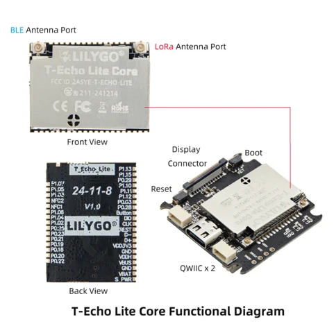

# T-Echo Lite Core V1.0

**LILYGO** · nRF52840

Revision: V1.0 pictured; 24-11-18 silkscreen  
Coverage: Supporting reference collected; complete physical pinout needed

[Browse all manufacturers](../../../../BROWSE.md) · [Devices & IoT](../../../../DEVICES.md) · [Open in the browser guide](https://valleytech-black-wire-guide.pages.dev/?board=lilygo-gpio-device-t-echo-lite-core-v1-0)

Device category: **Radios & GNSS**

## Core board functions, connectors and pad labels

**board labeling image** · Reviewed source · PNG

[Open original reference](../../../../library/media/209f1246efe3dca0f6f47039f946d3fcf16f9eba4d6935ea727a52ced03b5db6.png)

**Credit and rights:** Not established; source attribution retained. Source/manufacturer: LILYGO.

[Source 1](https://raw.githubusercontent.com/Xinyuan-LilyGO/T-Echo-Lite/7b59f6a0c3ac62d1a0843fe11101ac36cd441699/image/14.png) · [Source 2](https://github.com/Xinyuan-LilyGO/T-Echo-Lite)

Core V1.0 pictured. Includes antenna, display and Qwiic locations plus small board pad labels. Preserve the original resolution; this is not a complete carrier-board pinout.

Image revision: V1.0 pictured; 24-11-18 silkscreen

SHA-256: `209f1246efe3dca0f6f47039f946d3fcf16f9eba4d6935ea727a52ced03b5db6`

Pin assignments have not been independently electrically verified. Check board revision before wiring.
