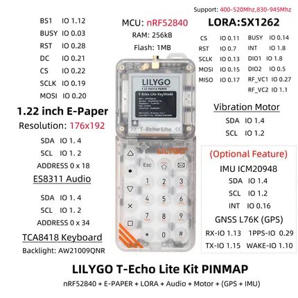

# T-Echo Lite Kit

**LILYGO** · nRF52840

Revision: Not identified  
Coverage: Pinout image collected

[Browse all manufacturers](../../../../BROWSE.md) · [Devices & IoT](../../../../DEVICES.md) · [Open in the browser guide](https://valleytech-black-wire-guide.pages.dev/?board=lilygo-other-t-echo-lite-kit)

Device category: **Radios & GNSS**

## Board pin map

**pinout image** · Reviewed source · JPG

[Open original reference](../../../../library/media/9167f335e25246075d300b48428dabb799c1f8527f71c0f756c77405e0d0f5ea.jpg)

**Credit and rights:** Not established; source attribution retained. Source/manufacturer: LILYGO.

[Source 1](https://wiki.lilygo.cc/products/t-echo-series/t-echo-lite-kit/index/image/t-echo-lite-kit-pinmap.jpg) · [Source 2](https://wiki.lilygo.cc/products/t-echo-series/t-echo-lite-kit/)

Manufacturer image preserved. Match the depicted board and revision before use.

Image revision: Not identified

SHA-256: `9167f335e25246075d300b48428dabb799c1f8527f71c0f756c77405e0d0f5ea`

Pin assignments have not been independently electrically verified. Check board revision before wiring.
