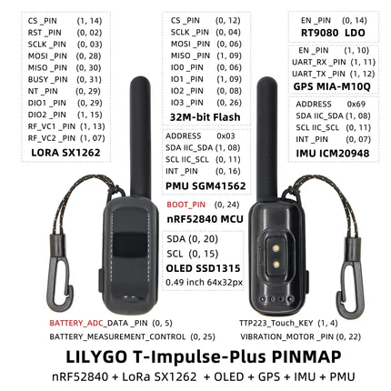

# T-Impulse Plus

**LILYGO** · nRF52840

Revision: Not identified  
Coverage: Pinout image collected

[Browse all manufacturers](../../../../BROWSE.md) · [Desktop app](https://github.com/valleytechsolutions/black-wire-desktop)

## Board pin map

**pinout image** · Reviewed source · JPG

[Open original reference](../../../../library/media/67efbcf57e9caa7b178b08ed42dd6332418bf0a814356681cb891674ab3e8355.jpg)

**Credit and rights:** Not established; source attribution retained. Source/manufacturer: LILYGO.

[Source 1](https://wiki.lilygo.cc/products/t-impulse-series/t-impulse-plus/index/image/t-impulse-plus-pinout.jpg) · [Source 2](https://wiki.lilygo.cc/products/t-impulse-series/t-impulse-plus/)

Manufacturer image preserved. Match the depicted board and revision before use.

SHA-256: `67efbcf57e9caa7b178b08ed42dd6332418bf0a814356681cb891674ab3e8355`

Pin assignments have not been independently electrically verified. Check board revision before wiring.
