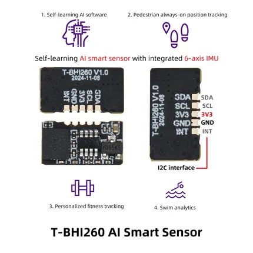

# T-BHI260AP

**LILYGO** · Other

Revision: Not identified  
Coverage: Pinout image collected

[Browse all manufacturers](../../../../BROWSE.md) · [Desktop app](https://github.com/valleytechsolutions/black-wire-desktop)

## Board pin map

**pinout image** · Reviewed source · JPG

[Open original reference](../../../../library/media/b96bfea107e8675f85e551ed022b69117f197793afe37aafb3c11f2c497e8f65.jpg)

**Credit and rights:** Not established; source attribution retained. Source/manufacturer: LILYGO.

[Source 1](https://wiki.lilygo.cc/products/other/t-bhi260ap/index/image/t-bhi260ap-3.jpg) · [Source 2](https://wiki.lilygo.cc/products/other/t-bhi260ap/)

Manufacturer image preserved. Match the depicted board and revision before use.

SHA-256: `b96bfea107e8675f85e551ed022b69117f197793afe37aafb3c11f2c497e8f65`

Pin assignments have not been independently electrically verified. Check board revision before wiring.
