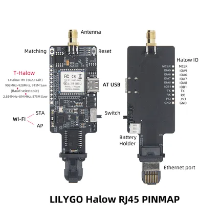

# T-Halow RJ45

**LILYGO** · Other

Revision: Not identified  
Coverage: Pinout image collected

[Browse all manufacturers](../../../../BROWSE.md) · [Desktop app](https://github.com/valleytechsolutions/black-wire-desktop)

## Board pin map

**pinout image** · Reviewed source · JPG

[Open original reference](../../../../library/media/c9f58520a0d43f1a5dd564ec21cb8bbe166e307ac3e21e64ec55a9211257fdbe.jpg)

**Credit and rights:** Not established; source attribution retained. Source/manufacturer: LILYGO.

[Source 1](https://wiki.lilygo.cc/products/t-halow-series/t-halow-rj45/index/image/t-halow-rj45-pinout.jpg) · [Source 2](https://wiki.lilygo.cc/products/t-halow-series/t-halow-rj45/)

Manufacturer image preserved. Match the depicted board and revision before use.

SHA-256: `c9f58520a0d43f1a5dd564ec21cb8bbe166e307ac3e21e64ec55a9211257fdbe`

Pin assignments have not been independently electrically verified. Check board revision before wiring.
