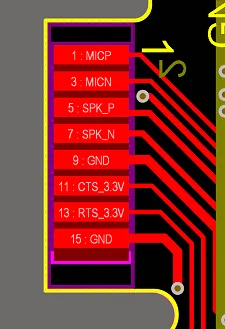

# T-PCIE SIM7600E

**LILYGO** · Other

Revision: Not identified  
Coverage: Partial pinout collected; full reference still needed

[Browse all manufacturers](../../../../BROWSE.md) · [Desktop app](https://github.com/valleytechsolutions/black-wire-desktop)

## Board pin map

**pinout image** · Reviewed source · PNG

[Open original reference](../../../../library/media/9fe33c0446058590a6e7fca3b24f6b81aac0d7e35b74ca55e9172c97a8166217.png)

**Credit and rights:** Not established; source attribution retained. Source/manufacturer: LILYGO.

[Source 1](https://wiki.lilygo.cc/products/t-sim-series/sim7600e/index/image/sim7600e-1.jpg) · [Source 2](https://wiki.lilygo.cc/products/t-sim-series/sim7600e/)

Manufacturer image preserved. Match the depicted board and revision before use.

**Partial diagram. Confirm missing pins against the exact board documentation.**

SHA-256: `9fe33c0446058590a6e7fca3b24f6b81aac0d7e35b74ca55e9172c97a8166217`

Pin assignments have not been independently electrically verified. Check board revision before wiring.
