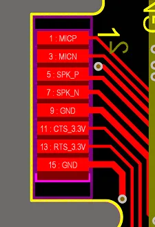

# T-PCIE SIM7600E

**LILYGO** · Other

Revision: Not identified

Coverage: Partial pinout collected; full reference still needed

[Browse all manufacturers](../../../../BROWSE.md) · [Devices & IoT](../../../../DEVICES.md) · [Open in the browser guide](https://valleytech-black-wire-guide.pages.dev/?board=lilygo-other-t-pcie-sim7600e)

## Datasheets and original documentation

Board datasheet: **not yet recorded**. Visual reference: **available**.

[Manufacturer source (recorded link)](https://wiki.lilygo.cc/products/t-sim-series/sim7600e/)

A chip datasheet, schematic and board datasheet have different scopes. Match the exact hardware revision.

[Documentation coverage and remaining gaps](../../../../DOCUMENTATION.md)

## Board pin map

**pinout image** · Reviewed source · PNG

[Open original reference](../../../../library/media/9fe33c0446058590a6e7fca3b24f6b81aac0d7e35b74ca55e9172c97a8166217.png)

**Credit and rights:** Not established; source attribution retained. Source/manufacturer: LILYGO.

[Source 1](https://wiki.lilygo.cc/products/t-sim-series/sim7600e/index/image/sim7600e-1.jpg) · [Source 2](https://wiki.lilygo.cc/products/t-sim-series/sim7600e/)

Manufacturer image preserved. Match the depicted board and revision before use.

Image revision: Not identified

SHA-256: `9fe33c0446058590a6e7fca3b24f6b81aac0d7e35b74ca55e9172c97a8166217`

Pin assignments have not been independently electrically verified. Check board revision before wiring.
