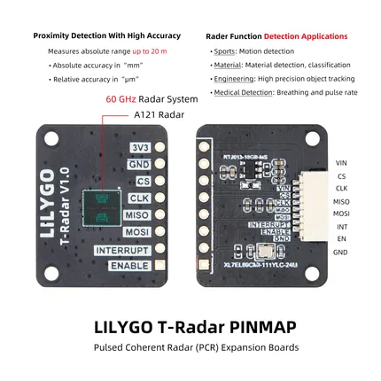

# T-Radar

**LILYGO** · Other

Revision: Not identified  
Coverage: Pinout image collected

[Browse all manufacturers](../../../../BROWSE.md) · [Desktop app](https://github.com/valleytechsolutions/black-wire-desktop)

## Board pin map

**pinout image** · Reviewed source · JPG

[Open original reference](../../../../library/media/3be58674462654d531e039b7346bb69f4a42e7e2460cfae847b5ff60a271beed.jpg)

**Credit and rights:** Not established; source attribution retained. Source/manufacturer: LILYGO.

[Source 1](https://wiki.lilygo.cc/products/other/t-radar/index/image/t-radar-pin.jpg) · [Source 2](https://wiki.lilygo.cc/products/other/t-radar/)

Manufacturer image preserved. Match the depicted board and revision before use.

SHA-256: `3be58674462654d531e039b7346bb69f4a42e7e2460cfae847b5ff60a271beed`

Pin assignments have not been independently electrically verified. Check board revision before wiring.
