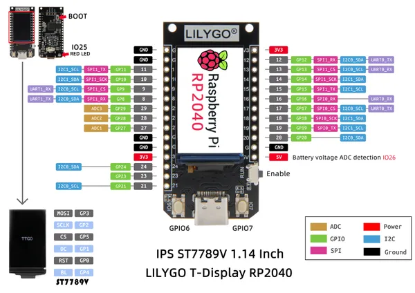

# T-Display RP2040

**LILYGO** · RP2040

Revision: Not identified  
Coverage: Pinout image collected

[Browse all manufacturers](../../../../BROWSE.md) · [Devices & IoT](../../../../DEVICES.md) · [Open in the browser guide](https://valleytech-black-wire-guide.pages.dev/?board=lilygo-rp2040-t-display-rp2040)

Device category: **Displays & HMI**

## T-display-RP2040

**pinout image** · Reviewed source · JPG

[Open original reference](../../../../library/media/3ef430f09cb173e0000cc2a9d00bedf63919746d117325010ee4db40bf1ba500.jpg)

**Credit and rights:** Not established; source attribution retained. Source/manufacturer: LILYGO.

[Source 1](https://raw.githubusercontent.com/Xinyuan-LilyGO/LILYGO-T-display-RP2040/107393af5c4bc1ce7a8b3735c90db531b296bc14/img/T-display-RP2040.jpg) · [Source 2](https://github.com/Xinyuan-LilyGO/LILYGO-T-display-RP2040/blob/107393af5c4bc1ce7a8b3735c90db531b296bc14/img/T-display-RP2040.jpg)

Original manufacturer diagram. Shown module, radio, display and power-system options must match the board.

Image revision: Not identified

SHA-256: `3ef430f09cb173e0000cc2a9d00bedf63919746d117325010ee4db40bf1ba500`

Pin assignments have not been independently electrically verified. Check board revision before wiring.
