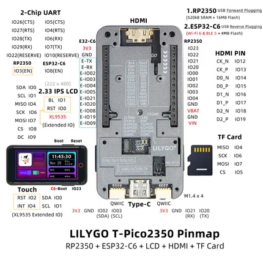

# T-PICO-2350

**LILYGO** · RP2350

Revision: Not identified

Coverage: Pinout image collected

[Browse all manufacturers](../../../../BROWSE.md) · [Devices & IoT](../../../../DEVICES.md) · [Open in the browser guide](https://valleytech-black-wire-guide.pages.dev/?board=lilygo-rp2350-t-pico-2350)

## Datasheets and original documentation

Board datasheet: **not yet recorded**. Visual reference: **available**.

[Manufacturer source (recorded link)](https://wiki.lilygo.cc/products/other/t-pico-2350/)

A chip datasheet, schematic and board datasheet have different scopes. Match the exact hardware revision.

[Documentation coverage and remaining gaps](../../../../DOCUMENTATION.md)

## Board pin map

**pinout image** · Reviewed source · JPG

[Open original reference](../../../../library/media/50bd861113bd1e89d81e00f32d3997804520721fd0fcc13e7da065c8365364d2.jpg)

**Credit and rights:** Not established; source attribution retained. Source/manufacturer: LILYGO.

[Source 1](https://wiki.lilygo.cc/products/other/t-pico-2350/index/image/t-pico-2350-01.jpg) · [Source 2](https://wiki.lilygo.cc/products/other/t-pico-2350/)

Manufacturer image preserved. Match the depicted board and revision before use.

Image revision: Not identified

SHA-256: `50bd861113bd1e89d81e00f32d3997804520721fd0fcc13e7da065c8365364d2`

Pin assignments have not been independently electrically verified. Check board revision before wiring.
