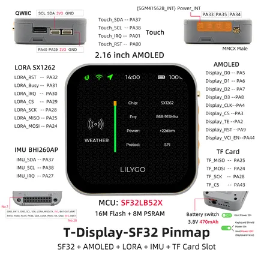

# T-Display SF32

**LILYGO** · SF32LB52X

Revision: Not identified  
Coverage: Pinout image collected

[Browse all manufacturers](../../../../BROWSE.md) · [Desktop app](https://github.com/valleytechsolutions/black-wire-desktop)

## Board pin map

**pinout image** · Reviewed source · JPG

[Open original reference](../../../../library/media/d65268cbaf81d9e8a0a767a49d192dc74a2ce8a92ef2ce2ae584e4349be1c444.jpg)

**Credit and rights:** Not established; source attribution retained. Source/manufacturer: LILYGO.

[Source 1](https://wiki.lilygo.cc/products/t-display-series/t-display-sf32/index/image/t-display-sf32-pinout.jpg) · [Source 2](https://wiki.lilygo.cc/products/t-display-series/t-display-sf32/)

Manufacturer image preserved. Match the depicted board and revision before use.

SHA-256: `d65268cbaf81d9e8a0a767a49d192dc74a2ce8a92ef2ce2ae584e4349be1c444`

Pin assignments have not been independently electrically verified. Check board revision before wiring.
