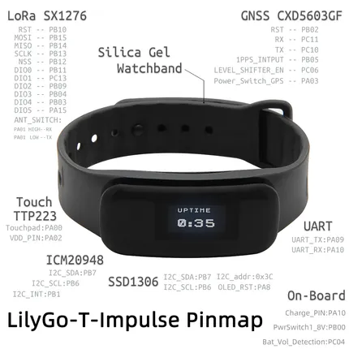

# T-Impulse

**LILYGO** · STM32

Revision: Internal peripheral assignments; does not locate all accessible pads  
Coverage: GPIO reference collected; physical pinout needed

[Browse all manufacturers](../../../../BROWSE.md) · [Desktop app](https://github.com/valleytechsolutions/black-wire-desktop)

## PinOut

**GPIO reference image** · Reviewed source · JPG

[Open original reference](../../../../library/media/bd369c86e4a660d1111bdba7850f81c1b4d8624cbf7107cff54f7fbff1c6990b.jpg)

**Credit and rights:** Not established; source attribution retained. Source/manufacturer: LILYGO.

[Source 1](https://raw.githubusercontent.com/Xinyuan-LilyGO/T-Impulse/1b28bfad6832b81fee09b274181968f69d25f6ae/image/PinOut.jpg) · [Source 2](https://github.com/Xinyuan-LilyGO/T-Impulse/blob/1b28bfad6832b81fee09b274181968f69d25f6ae/image/PinOut.jpg)

Internal peripheral assignments; does not locate all accessible pads

SHA-256: `bd369c86e4a660d1111bdba7850f81c1b4d8624cbf7107cff54f7fbff1c6990b`

Pin assignments have not been independently electrically verified. Check board revision before wiring.
