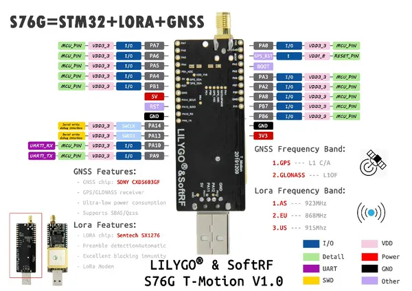
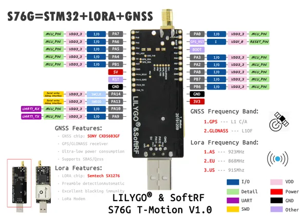

# T-Motion V1.0

**LILYGO** · STM32

Revision: Multiple source/revision records; see individual assets  
Coverage: Pinout image collected

[Browse all manufacturers](../../../../BROWSE.md) · [Desktop app](https://github.com/valleytechsolutions/black-wire-desktop)

## t-motion_v1.0_pinmap

**pinout image** · Reviewed source · JPG

[Open original reference](../../../../library/media/f9037a574ef8a4948c75956acd6f37003bc22ac6ef6963b1e05ef0b16e7321a0.jpg)

**Credit and rights:** Not established; source attribution retained. Source/manufacturer: LILYGO.

[Source 1](https://raw.githubusercontent.com/Xinyuan-LilyGO/LilyGo-LoRa-Series/5e2da3f519a25e91b9b14c3071e36a568bbd949d/assets/image/t-motion_v1.0_pinmap.jpg) · [Source 2](https://github.com/Xinyuan-LilyGO/LilyGo-LoRa-Series/blob/5e2da3f519a25e91b9b14c3071e36a568bbd949d/assets/image/t-motion_v1.0_pinmap.jpg)

S76G STM32 LoRa GNSS development board

SHA-256: `f9037a574ef8a4948c75956acd6f37003bc22ac6ef6963b1e05ef0b16e7321a0`

## 1

**pinout image** · Reviewed source · JPG

[Open original reference](../../../../library/media/e06dae3b7b66c6b7e2ee9746803d95b69ec5e0d93df4a2130b0ac3db8fcdc5db.jpg)

**Credit and rights:** Not established; source attribution retained. Source/manufacturer: LILYGO.

[Source 1](https://raw.githubusercontent.com/Xinyuan-LilyGO/LilyGO-T-Motion/df43b537b453441e3d68071aebcd4928436562dd/Image/1.jpg) · [Source 2](https://github.com/Xinyuan-LilyGO/LilyGO-T-Motion/blob/df43b537b453441e3d68071aebcd4928436562dd/Image/1.jpg)

Original manufacturer diagram. Shown module, radio, display and power-system options must match the board.

SHA-256: `e06dae3b7b66c6b7e2ee9746803d95b69ec5e0d93df4a2130b0ac3db8fcdc5db`

Pin assignments have not been independently electrically verified. Check board revision before wiring.
