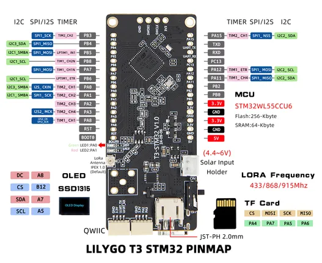

# T3-STM32

**LILYGO** · STM32

Revision: Not identified  
Coverage: Pinout image collected

[Browse all manufacturers](../../../../BROWSE.md) · [Desktop app](https://github.com/valleytechsolutions/black-wire-desktop)

## Board pin map

**pinout image** · Reviewed source · JPG

[Open original reference](../../../../library/media/e1082272f79e2becc252ea9f3183a607586d92779160d02432d81816c8ab36c4.jpg)

**Credit and rights:** Not established; source attribution retained. Source/manufacturer: LILYGO.

[Source 1](https://wiki.lilygo.cc/products/t3-series/t3-stm32/index/image/t3-stm32-3.jpg) · [Source 2](https://wiki.lilygo.cc/products/t3-series/t3-stm32/)

Manufacturer image preserved. Match the depicted board and revision before use.

SHA-256: `e1082272f79e2becc252ea9f3183a607586d92779160d02432d81816c8ab36c4`

Pin assignments have not been independently electrically verified. Check board revision before wiring.
