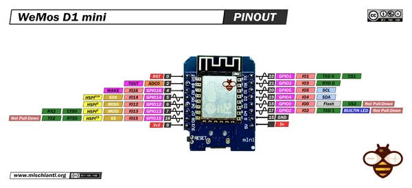

# D1 MINI

**LOLIN** · ESP8266

Revision: ESP8266 D1 mini layout pictured; not D1 mini Lite  
Coverage: Pinout image collected

[Browse all manufacturers](../../../../BROWSE.md) · [Desktop app](https://github.com/valleytechsolutions/black-wire-desktop)

## Pinout - Renzo Mischianti

**pinout image** · Reviewed source · JPG

[Open original reference](../../../../library/media/615f9b048af8abdb7ccd719e43ef2c4c23ef29f0ceec770778a93c1843ea69b2.jpg)

**Credit and rights:** CC BY-NC-ND marking visible on image; exact license version and publication permissions not established. Source/manufacturer: LOLIN.

[Source 1](https://mischianti.org/wp-content/uploads/2021/04/WeMos-D1-mini-esp8266-pinout-mischianti-low.jpg) · [Source 2](https://mischianti.org/wemos-d1-mini-high-resolution-pinout-and-specs/)

Original public image by Renzo Mischianti, unchanged. Diagram/model matching is visual, not electrical verification. Exact PCB layout and revision must match; no inference of compatibility with lookalike marketplace clones.

SHA-256: `615f9b048af8abdb7ccd719e43ef2c4c23ef29f0ceec770778a93c1843ea69b2`

Pin assignments have not been independently electrically verified. Check board revision before wiring.
