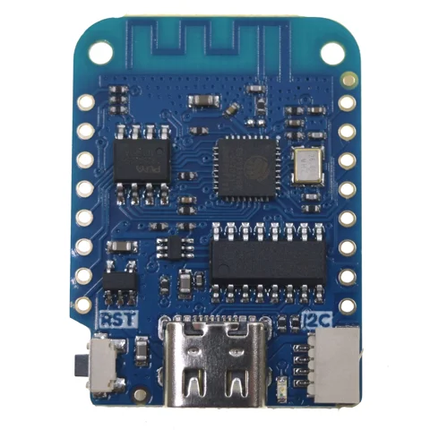
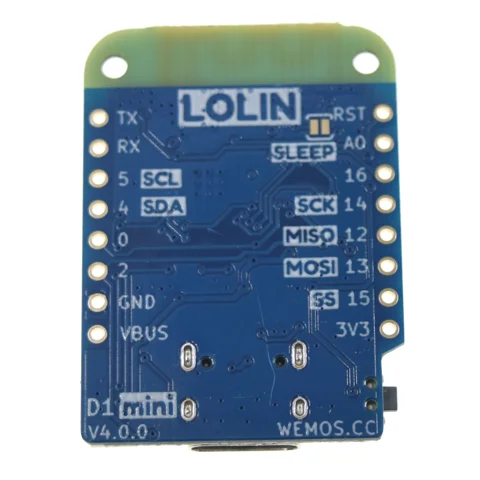

# D1 MINI

**LOLIN** · ESP8266

Revision: V4.0.0

Coverage: Physical source pinout available; independent completeness review pending

[Browse all manufacturers](../../../../BROWSE.md) · [Devices & IoT](../../../../DEVICES.md) · [Open in the browser guide](https://valleytech-black-wire-guide.pages.dev/?board=lolin-esp32-d1-mini)

## Datasheets and original documentation

Board datasheet: **not yet recorded**. Visual reference: **available**.

[Original manufacturer / project documentation](https://www.wemos.cc/en/latest/d1/d1_mini.html)

- **hardware-guide / board**: [D1 MINI specifications and pin table](https://www.wemos.cc/en/latest/d1/d1_mini.html) · online
- **schematic / board**: [Schematic V4.0.0[PDF]](https://www.wemos.cc/en/latest/_static/files/sch_d1_mini_v4.0.0.pdf) · [saved document](../../../../library/media/831c53db151995272787cae8bd8e01532b626314627920df88541be44e2364b4.pdf)

Source identity and visual scope reviewed. Pin assignments and electrical limits are not independently bench-verified. Match the exact PCB revision, connector view and populated options. The manufacturer HTML reference includes pin-to-GPIO mapping. Board photos show silkscreen labels; the schematic is a separate reference. D1 mini Lite uses ESP8285; Pro and standard D1 mini use ESP8266. Do not substitute clone revisions.

[Documentation coverage and remaining gaps](../../../../DOCUMENTATION.md)

## Pinout - Renzo Mischianti

**pinout image** · Reviewed source · JPG

[Open original reference](../../../../library/media/615f9b048af8abdb7ccd719e43ef2c4c23ef29f0ceec770778a93c1843ea69b2.jpg)

**Credit and rights:** CC BY-NC-ND marking visible on image; exact license version and publication permissions not established. Source/manufacturer: LOLIN.

[Source 1](https://mischianti.org/wp-content/uploads/2021/04/WeMos-D1-mini-esp8266-pinout-mischianti-low.jpg) · [Source 2](https://mischianti.org/wemos-d1-mini-high-resolution-pinout-and-specs/)

Original public image by Renzo Mischianti, unchanged. Diagram/model matching is visual, not electrical verification. Exact PCB layout and revision must match; no inference of compatibility with lookalike marketplace clones.

Image revision: ESP8266 D1 mini layout pictured; not D1 mini Lite

SHA-256: `615f9b048af8abdb7ccd719e43ef2c4c23ef29f0ceec770778a93c1843ea69b2`

## D1 MINI V4.0.0 — original labeled board photograph

**board labeling image** · Source visual inspected; independent electrical and all-pin completeness review pending · PNG

[Open original reference](../../../../library/media/1e5239a6eeba9bf713113c9478d3437a5a784a189556aa7ba73e4f4c3d56e682.png)

**Credit and rights:** LOLIN / original artwork contributors. Asset-specific redistribution and print rights are not established; Black Wire licenses do not relicense this source artwork.. Source/manufacturer: LOLIN.

[Source 1](https://www.wemos.cc/en/latest/_images/d1_mini_v4.0.0_1_16x16.png) · [Source 2](https://www.wemos.cc/en/latest/d1/d1_mini.html)

Source identity and visual scope reviewed. Pin assignments and electrical limits are not independently bench-verified. Match the exact PCB revision, connector view and populated options. The manufacturer HTML reference includes pin-to-GPIO mapping. Board photos show silkscreen labels; the schematic is a separate reference. D1 mini Lite uses ESP8285; Pro and standard D1 mini use ESP8266. Do not substitute clone revisions.

Image revision: V4.0.0

SHA-256: `1e5239a6eeba9bf713113c9478d3437a5a784a189556aa7ba73e4f4c3d56e682`

## D1 MINI V4.0.0 — original labeled board photograph

**board labeling image** · Source visual inspected; independent electrical and all-pin completeness review pending · PNG

[Open original reference](../../../../library/media/bb5de7a623e1d95585ca5768e51569f88fe7e9ab2628b45ac9c0c098bae556a4.png)

**Credit and rights:** LOLIN / original artwork contributors. Asset-specific redistribution and print rights are not established; Black Wire licenses do not relicense this source artwork.. Source/manufacturer: LOLIN.

[Source 1](https://www.wemos.cc/en/latest/_images/d1_mini_v4.0.0_2_16x16.png) · [Source 2](https://www.wemos.cc/en/latest/d1/d1_mini.html)

Source identity and visual scope reviewed. Pin assignments and electrical limits are not independently bench-verified. Match the exact PCB revision, connector view and populated options. The manufacturer HTML reference includes pin-to-GPIO mapping. Board photos show silkscreen labels; the schematic is a separate reference. D1 mini Lite uses ESP8285; Pro and standard D1 mini use ESP8266. Do not substitute clone revisions.

Image revision: V4.0.0

SHA-256: `bb5de7a623e1d95585ca5768e51569f88fe7e9ab2628b45ac9c0c098bae556a4`

## Schematic V4.0.0[PDF]

**original reference PDF** · Source visual inspected; independent electrical and all-pin completeness review pending · PDF

[Open original reference](../../../../library/media/831c53db151995272787cae8bd8e01532b626314627920df88541be44e2364b4.pdf)

**Credit and rights:** LOLIN / original artwork contributors. Asset-specific redistribution and print rights are not established; Black Wire licenses do not relicense this source artwork.. Source/manufacturer: LOLIN.

[Source 1](https://www.wemos.cc/en/latest/_static/files/sch_d1_mini_v4.0.0.pdf) · [Source 2](https://www.wemos.cc/en/latest/d1/d1_mini.html)

Source identity and visual scope reviewed. Pin assignments and electrical limits are not independently bench-verified. Match the exact PCB revision, connector view and populated options. The manufacturer HTML reference includes pin-to-GPIO mapping. Board photos show silkscreen labels; the schematic is a separate reference. D1 mini Lite uses ESP8285; Pro and standard D1 mini use ESP8266. Do not substitute clone revisions.

Image revision: V4.0.0

SHA-256: `831c53db151995272787cae8bd8e01532b626314627920df88541be44e2364b4`

Pin assignments have not been independently electrically verified. Check board revision before wiring.
