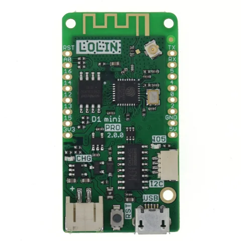
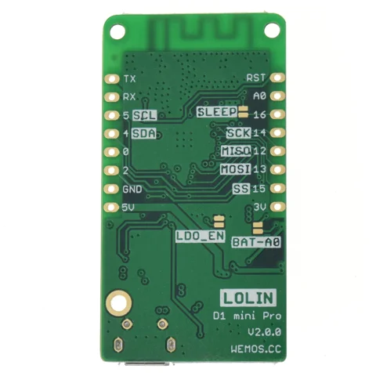

# D1 MINI PRO

**LOLIN** · ESP8266

Revision: V2.0.0

Coverage: Supporting references; complete physical pinout still needed

[Browse all manufacturers](../../../../BROWSE.md) · [Devices & IoT](../../../../DEVICES.md) · [Open in the browser guide](https://valleytech-black-wire-guide.pages.dev/?board=lolin-esp32-d1-mini-pro)

## Datasheets and original documentation

Board datasheet: **not yet recorded**. Visual reference: **available**.

[Original manufacturer / project documentation](https://www.wemos.cc/en/latest/d1/d1_mini_pro.html)

- **hardware-guide / board**: [D1 MINI PRO specifications and pin table](https://www.wemos.cc/en/latest/d1/d1_mini_pro.html) · online
- **schematic / board**: [Schematic V2.0.0[PDF]](https://www.wemos.cc/en/latest/_static/files/sch_d1_mini_pro_v2.0.0.pdf) · [saved document](../../../../library/media/f1580d86fbff61dd7fa9f237391013755d416ee8011123e8046fc30d0e1ccb82.pdf)
- **mechanical-drawing / board**: [Dimension V2.0.0[PDF]](https://www.wemos.cc/en/latest/_static/files/dim_d1_mini_pro_v2.0.0.pdf) · [saved document](../../../../library/media/61ab75578fb6d641dfa00ce0bf7daddf0750c61d8a4430b5e351af22bcb7848c.pdf)

Source identity and visual scope reviewed. Pin assignments and electrical limits are not independently bench-verified. Match the exact PCB revision, connector view and populated options. The manufacturer HTML reference includes pin-to-GPIO mapping. Board photos show silkscreen labels; the schematic is a separate reference. D1 mini Lite uses ESP8285; Pro and standard D1 mini use ESP8266. Do not substitute clone revisions.

[Documentation coverage and remaining gaps](../../../../DOCUMENTATION.md)

## D1 MINI PRO V2.0.0 — original labeled board photograph

**board labeling image** · Source visual inspected; independent electrical and all-pin completeness review pending · JPG

[Open original reference](../../../../library/media/36388d1193113c33416f8e1def61fe947f86701a1b290efdcd1504818e5d739f.jpg)

**Credit and rights:** LOLIN / original artwork contributors. Asset-specific redistribution and print rights are not established; Black Wire licenses do not relicense this source artwork.. Source/manufacturer: LOLIN.

[Source 1](https://www.wemos.cc/en/latest/_images/d1_mini_pro_v2.0.0_1_16x16.jpg) · [Source 2](https://www.wemos.cc/en/latest/d1/d1_mini_pro.html)

Source identity and visual scope reviewed. Pin assignments and electrical limits are not independently bench-verified. Match the exact PCB revision, connector view and populated options. The manufacturer HTML reference includes pin-to-GPIO mapping. Board photos show silkscreen labels; the schematic is a separate reference. D1 mini Lite uses ESP8285; Pro and standard D1 mini use ESP8266. Do not substitute clone revisions.

Image revision: V2.0.0

SHA-256: `36388d1193113c33416f8e1def61fe947f86701a1b290efdcd1504818e5d739f`

## D1 MINI PRO V2.0.0 — original labeled board photograph

**board labeling image** · Source visual inspected; independent electrical and all-pin completeness review pending · JPG

[Open original reference](../../../../library/media/97def22bee4561ab5c53990edc408bd1354569b6451141a899a29a2aa4ed1c2e.jpg)

**Credit and rights:** LOLIN / original artwork contributors. Asset-specific redistribution and print rights are not established; Black Wire licenses do not relicense this source artwork.. Source/manufacturer: LOLIN.

[Source 1](https://www.wemos.cc/en/latest/_images/d1_mini_pro_v2.0.0_2_16x16.jpg) · [Source 2](https://www.wemos.cc/en/latest/d1/d1_mini_pro.html)

Source identity and visual scope reviewed. Pin assignments and electrical limits are not independently bench-verified. Match the exact PCB revision, connector view and populated options. The manufacturer HTML reference includes pin-to-GPIO mapping. Board photos show silkscreen labels; the schematic is a separate reference. D1 mini Lite uses ESP8285; Pro and standard D1 mini use ESP8266. Do not substitute clone revisions.

Image revision: V2.0.0

SHA-256: `97def22bee4561ab5c53990edc408bd1354569b6451141a899a29a2aa4ed1c2e`

## Schematic V2.0.0[PDF]

**original reference PDF** · Source visual inspected; independent electrical and all-pin completeness review pending · PDF

[Open original reference](../../../../library/media/f1580d86fbff61dd7fa9f237391013755d416ee8011123e8046fc30d0e1ccb82.pdf)

**Credit and rights:** LOLIN / original artwork contributors. Asset-specific redistribution and print rights are not established; Black Wire licenses do not relicense this source artwork.. Source/manufacturer: LOLIN.

[Source 1](https://www.wemos.cc/en/latest/_static/files/sch_d1_mini_pro_v2.0.0.pdf) · [Source 2](https://www.wemos.cc/en/latest/d1/d1_mini_pro.html)

Source identity and visual scope reviewed. Pin assignments and electrical limits are not independently bench-verified. Match the exact PCB revision, connector view and populated options. The manufacturer HTML reference includes pin-to-GPIO mapping. Board photos show silkscreen labels; the schematic is a separate reference. D1 mini Lite uses ESP8285; Pro and standard D1 mini use ESP8266. Do not substitute clone revisions.

Image revision: V2.0.0

SHA-256: `f1580d86fbff61dd7fa9f237391013755d416ee8011123e8046fc30d0e1ccb82`

## Dimension V2.0.0[PDF]

**original reference PDF** · Source visual inspected; independent electrical and all-pin completeness review pending · PDF

[Open original reference](../../../../library/media/61ab75578fb6d641dfa00ce0bf7daddf0750c61d8a4430b5e351af22bcb7848c.pdf)

**Credit and rights:** LOLIN / original artwork contributors. Asset-specific redistribution and print rights are not established; Black Wire licenses do not relicense this source artwork.. Source/manufacturer: LOLIN.

[Source 1](https://www.wemos.cc/en/latest/_static/files/dim_d1_mini_pro_v2.0.0.pdf) · [Source 2](https://www.wemos.cc/en/latest/d1/d1_mini_pro.html)

Source identity and visual scope reviewed. Pin assignments and electrical limits are not independently bench-verified. Match the exact PCB revision, connector view and populated options. The manufacturer HTML reference includes pin-to-GPIO mapping. Board photos show silkscreen labels; the schematic is a separate reference. D1 mini Lite uses ESP8285; Pro and standard D1 mini use ESP8266. Do not substitute clone revisions.

Image revision: V2.0.0

SHA-256: `61ab75578fb6d641dfa00ce0bf7daddf0750c61d8a4430b5e351af22bcb7848c`

Pin assignments have not been independently electrically verified. Check board revision before wiring.
