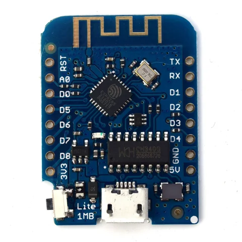
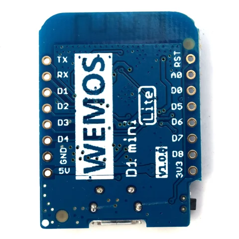

# D1 MINI LITE

**LOLIN** · ESP8285

Revision: V1.0.0

Coverage: Supporting references; complete physical pinout still needed

[Browse all manufacturers](../../../../BROWSE.md) · [Devices & IoT](../../../../DEVICES.md) · [Open in the browser guide](https://valleytech-black-wire-guide.pages.dev/?board=lolin-esp32-d1-mini-lite)

## Datasheets and original documentation

Board datasheet: **not yet recorded**. Visual reference: **available**.

[Original manufacturer / project documentation](https://www.wemos.cc/en/latest/d1/d1_mini_lite.html)

- **hardware-guide / board**: [D1 MINI LITE specifications and pin table](https://www.wemos.cc/en/latest/d1/d1_mini_lite.html) · online
- **schematic / board**: [Schematic V1.0.0 [PDF]](https://www.wemos.cc/en/latest/_static/files/sch_d1_mini_lite_v1.0.0.pdf) · [saved document](../../../../library/media/2c43613e76b5a56fb34e8c4f38b35c5a446358d02b25dcfa9e0d5b7f32399512.pdf)

Source identity and visual scope reviewed. Pin assignments and electrical limits are not independently bench-verified. Match the exact PCB revision, connector view and populated options. The manufacturer HTML reference includes pin-to-GPIO mapping. Board photos show silkscreen labels; the schematic is a separate reference. D1 mini Lite uses ESP8285; Pro and standard D1 mini use ESP8266. Do not substitute clone revisions.

[Documentation coverage and remaining gaps](../../../../DOCUMENTATION.md)

## D1 MINI LITE V1.0.0 — original labeled board photograph

**board labeling image** · Source visual inspected; independent electrical and all-pin completeness review pending · JPG

[Open original reference](../../../../library/media/63b2788c8df7eab7e3e09a097825078bec014bb85a4cc01906cf0af848d2c84e.jpg)

**Credit and rights:** LOLIN / original artwork contributors. Asset-specific redistribution and print rights are not established; Black Wire licenses do not relicense this source artwork.. Source/manufacturer: LOLIN.

[Source 1](https://www.wemos.cc/en/latest/_images/d1_mini_lite_v1.0.0_1_16x16.jpg) · [Source 2](https://www.wemos.cc/en/latest/d1/d1_mini_lite.html)

Source identity and visual scope reviewed. Pin assignments and electrical limits are not independently bench-verified. Match the exact PCB revision, connector view and populated options. The manufacturer HTML reference includes pin-to-GPIO mapping. Board photos show silkscreen labels; the schematic is a separate reference. D1 mini Lite uses ESP8285; Pro and standard D1 mini use ESP8266. Do not substitute clone revisions.

Image revision: V1.0.0

SHA-256: `63b2788c8df7eab7e3e09a097825078bec014bb85a4cc01906cf0af848d2c84e`

## D1 MINI LITE V1.0.0 — original labeled board photograph

**board labeling image** · Source visual inspected; independent electrical and all-pin completeness review pending · JPG

[Open original reference](../../../../library/media/e36cb41cc55f8dd3d654137e86d57d97e8d3465ed01fa3442afd1b4fcf3e226f.jpg)

**Credit and rights:** LOLIN / original artwork contributors. Asset-specific redistribution and print rights are not established; Black Wire licenses do not relicense this source artwork.. Source/manufacturer: LOLIN.

[Source 1](https://www.wemos.cc/en/latest/_images/d1_mini_lite_v1.0.0_2_16x16.jpg) · [Source 2](https://www.wemos.cc/en/latest/d1/d1_mini_lite.html)

Source identity and visual scope reviewed. Pin assignments and electrical limits are not independently bench-verified. Match the exact PCB revision, connector view and populated options. The manufacturer HTML reference includes pin-to-GPIO mapping. Board photos show silkscreen labels; the schematic is a separate reference. D1 mini Lite uses ESP8285; Pro and standard D1 mini use ESP8266. Do not substitute clone revisions.

Image revision: V1.0.0

SHA-256: `e36cb41cc55f8dd3d654137e86d57d97e8d3465ed01fa3442afd1b4fcf3e226f`

## Schematic V1.0.0 [PDF]

**original reference PDF** · Source visual inspected; independent electrical and all-pin completeness review pending · PDF

[Open original reference](../../../../library/media/2c43613e76b5a56fb34e8c4f38b35c5a446358d02b25dcfa9e0d5b7f32399512.pdf)

**Credit and rights:** LOLIN / original artwork contributors. Asset-specific redistribution and print rights are not established; Black Wire licenses do not relicense this source artwork.. Source/manufacturer: LOLIN.

[Source 1](https://www.wemos.cc/en/latest/_static/files/sch_d1_mini_lite_v1.0.0.pdf) · [Source 2](https://www.wemos.cc/en/latest/d1/d1_mini_lite.html)

Source identity and visual scope reviewed. Pin assignments and electrical limits are not independently bench-verified. Match the exact PCB revision, connector view and populated options. The manufacturer HTML reference includes pin-to-GPIO mapping. Board photos show silkscreen labels; the schematic is a separate reference. D1 mini Lite uses ESP8285; Pro and standard D1 mini use ESP8266. Do not substitute clone revisions.

Image revision: V1.0.0

SHA-256: `2c43613e76b5a56fb34e8c4f38b35c5a446358d02b25dcfa9e0d5b7f32399512`

Pin assignments have not been independently electrically verified. Check board revision before wiring.
