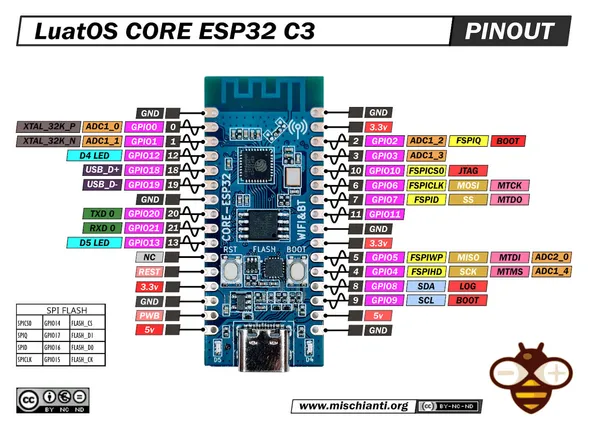

# Luatos Core ESP32C3

**Luatos** · ESP32-C3

Revision: Not identified; match photographed USB-UART layout  
Coverage: Pinout image collected

[Browse all manufacturers](../../../../BROWSE.md) · [Desktop app](https://github.com/valleytechsolutions/black-wire-desktop)

## Pinout - Renzo Mischianti

**pinout image** · Reviewed source · JPG

[Open original reference](../../../../library/media/a4247b8b1195be266b66ddf2c41f078a360c7734891b9eb414c971dd81804f91.jpg)

**Credit and rights:** CC BY-NC-ND marking visible on image; exact license version and publication permissions not established. Source/manufacturer: Luatos.

[Source 1](https://mischianti.org/wp-content/uploads/2023/04/LuatOS-CORE-ESP32-C3-pinout-low.jpg) · [Source 2](https://mischianti.org/luatos-core-esp32-c3-high-resolution-pinout-and-specs/)

Original public image by Renzo Mischianti, unchanged. Diagram/model matching is visual, not electrical verification. Exact PCB layout and revision must match; no inference of compatibility with lookalike marketplace clones.

SHA-256: `a4247b8b1195be266b66ddf2c41f078a360c7734891b9eb414c971dd81804f91`

Pin assignments have not been independently electrically verified. Check board revision before wiring.
