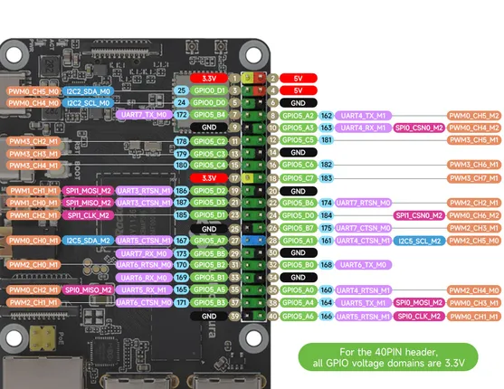
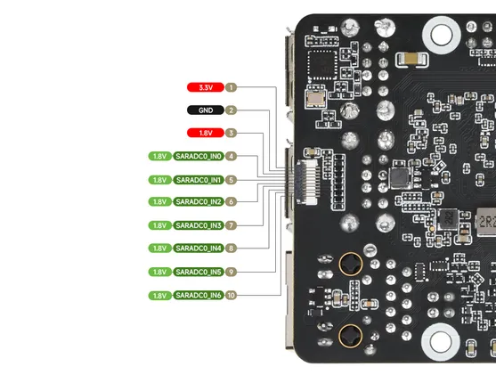

# Luckfox Aura

**Luckfox** · Other

Revision: Not identified  
Coverage: Pinout image collected

[Browse all manufacturers](../../../../BROWSE.md) · [Desktop app](https://github.com/valleytechsolutions/black-wire-desktop)

## Pinout

**pinout image** · Reviewed source · JPG

[Open original reference](../../../../library/media/0fb7a9a3a81ee838ce17654129696b982daf2d7deb66d2601dac720078391208.jpg)

**Credit and rights:** Not recorded; retain original attribution. Source/manufacturer: Luckfox.

[Source 1](https://www.waveshare.com/img/devkit/Luckfox-Aura-04000/Luckfox-Aura-04000-details-inter.jpg) · [Source 2](https://www.waveshare.com/luckfox-aura.htm)

SHA-256: `0fb7a9a3a81ee838ce17654129696b982daf2d7deb66d2601dac720078391208`

## Pinout

**pinout image** · Reviewed source · JPG

[Open original reference](../../../../library/media/40a0695b5fb2dfaddff230bb21d1336b23a0e2a2aa38fe9904c876bb838d4257.jpg)

**Credit and rights:** Not recorded; retain original attribution. Source/manufacturer: Luckfox.

[Source 1](https://www.waveshare.com/img/devkit/Luckfox-Aura-04000/Luckfox-Aura-04000-details-inter-1.jpg) · [Source 2](https://www.waveshare.com/luckfox-aura.htm)

SHA-256: `40a0695b5fb2dfaddff230bb21d1336b23a0e2a2aa38fe9904c876bb838d4257`

Pin assignments have not been independently electrically verified. Check board revision before wiring.
