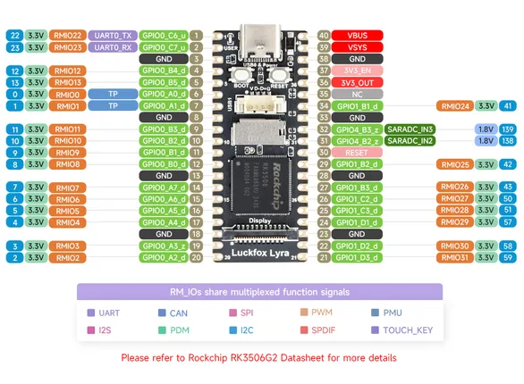

# Luckfox Lyra

**Luckfox** · Other

Revision: Not identified  
Coverage: Pinout image collected

[Browse all manufacturers](../../../../BROWSE.md) · [Desktop app](https://github.com/valleytechsolutions/black-wire-desktop)

## Pinout

**pinout image** · Reviewed source · JPG

[Open original reference](../../../../library/media/3342edc21e6c100c0bbe817bfeccfa3f5130fc4a8f8d1e554d18ea5288e3a3a6.jpg)

**Credit and rights:** Not recorded; retain original attribution. Source/manufacturer: Luckfox.

[Source 1](https://www.waveshare.com/img/devkit/Luckfox-Lyra-B/Luckfox-Lyra-B-details-inter.jpg) · [Source 2](https://www.waveshare.com/luckfox-lyra.htm)

SHA-256: `3342edc21e6c100c0bbe817bfeccfa3f5130fc4a8f8d1e554d18ea5288e3a3a6`

Pin assignments have not been independently electrically verified. Check board revision before wiring.
