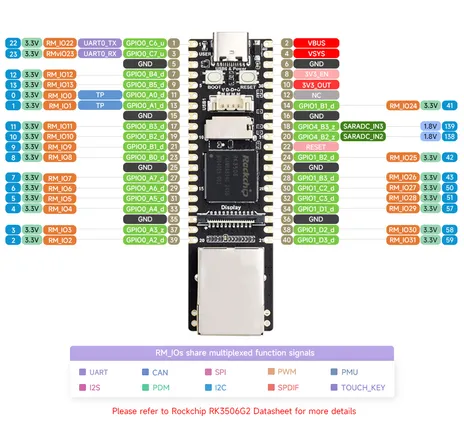

# Luckfox Lyra Plus

**Luckfox** · Other

Revision: Not identified  
Coverage: Pinout image collected

[Browse all manufacturers](../../../../BROWSE.md) · [Desktop app](https://github.com/valleytechsolutions/black-wire-desktop)

## Pinout

**pinout image** · Reviewed source · JPG

[Open original reference](../../../../library/media/c63a696fc8d88406ebcec0ca9ffc56d539a356a16dbcea25c9f26ef47fe089f5.jpg)

**Credit and rights:** Not recorded; retain original attribution. Source/manufacturer: Luckfox.

[Source 1](https://www.waveshare.com/img/devkit/Luckfox-Lyra-Plus/Luckfox-Lyra-Plus-details-inter.jpg) · [Source 2](https://www.waveshare.com/luckfox-lyra-plus.htm)

SHA-256: `c63a696fc8d88406ebcec0ca9ffc56d539a356a16dbcea25c9f26ef47fe089f5`

Pin assignments have not been independently electrically verified. Check board revision before wiring.
