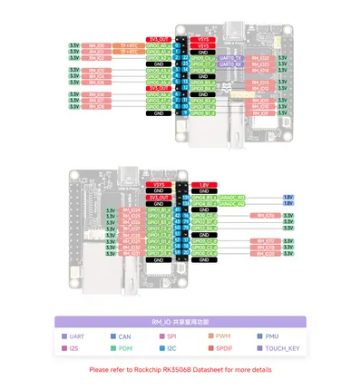

# Luckfox Lyra Ultra

**Luckfox** · Other

Revision: Not identified  
Coverage: Pinout image collected

[Browse all manufacturers](../../../../BROWSE.md) · [Desktop app](https://github.com/valleytechsolutions/black-wire-desktop)

## Pinout

**pinout image** · Reviewed source · JPG

[Open original reference](../../../../library/media/8d6f2ed81ad486f5fb5f217c1f554c1c6cac2ce43de8330e891bf881db617530.jpg)

**Credit and rights:** Not recorded; retain original attribution. Source/manufacturer: Luckfox.

[Source 1](https://www.waveshare.com/img/devkit/Luckfox-Lyra-Ultra/Luckfox-Lyra-Ultra-details-inter.jpg) · [Source 2](https://www.waveshare.com/luckfox-lyra-ultra.htm)

SHA-256: `8d6f2ed81ad486f5fb5f217c1f554c1c6cac2ce43de8330e891bf881db617530`

Pin assignments have not been independently electrically verified. Check board revision before wiring.
