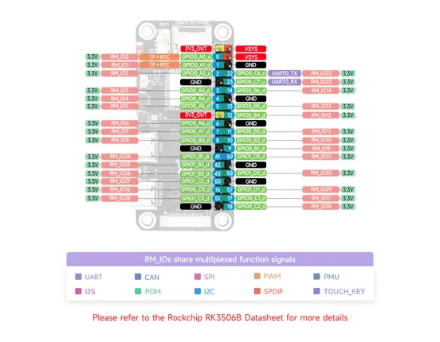

# Luckfox Lyra Zero W

**Luckfox** · Other

Revision: Not identified  
Coverage: Pinout image collected

[Browse all manufacturers](../../../../BROWSE.md) · [Desktop app](https://github.com/valleytechsolutions/black-wire-desktop)

## Pinout

**pinout image** · Reviewed source · JPG

[Open original reference](../../../../library/media/7b3144f357f91e92790411a013af024ca3c654c68ccf91c30ed443a106d45b8d.jpg)

**Credit and rights:** Not recorded; retain original attribution. Source/manufacturer: Luckfox.

[Source 1](https://www.waveshare.com/img/devkit/Luckfox-Lyra-Zero-W/Luckfox-Lyra-Zero-W-inter.jpg) · [Source 2](https://www.waveshare.com/luckfox-lyra-zero-w.htm)

SHA-256: `7b3144f357f91e92790411a013af024ca3c654c68ccf91c30ed443a106d45b8d`

Pin assignments have not been independently electrically verified. Check board revision before wiring.
