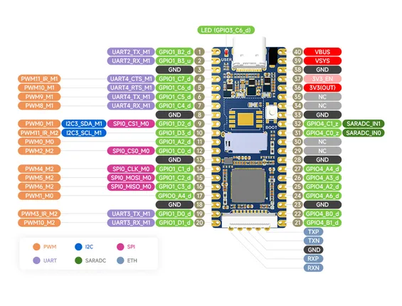

# Luckfox Pico

**Luckfox** · Other

Revision: Not identified  
Coverage: Pinout image collected

[Browse all manufacturers](../../../../BROWSE.md) · [Desktop app](https://github.com/valleytechsolutions/black-wire-desktop)

## Pinout

**pinout image** · Reviewed source · JPG

[Open original reference](../../../../library/media/661d797e776cdcdc7541666fc37c59dd53baaf8b8a4d9be28de2f629e2fbb04d.jpg)

**Credit and rights:** Not recorded; retain original attribution. Source/manufacturer: Luckfox.

[Source 1](https://www.waveshare.com/img/devkit/Luckfox-Pico/Luckfox-Pico-details-inter.jpg) · [Source 2](https://www.waveshare.com/luckfox-pico.htm)

SHA-256: `661d797e776cdcdc7541666fc37c59dd53baaf8b8a4d9be28de2f629e2fbb04d`

Pin assignments have not been independently electrically verified. Check board revision before wiring.
