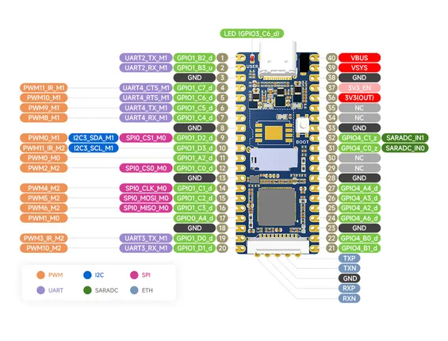

# Luckfox Pico

**Luckfox** · Other

Revision: Not identified

Coverage: Pinout image collected

[Browse all manufacturers](../../../../BROWSE.md) · [Devices & IoT](../../../../DEVICES.md) · [Open in the browser guide](https://valleytech-black-wire-guide.pages.dev/?board=luckfox-other-pico)

## Datasheets and original documentation

Board datasheet: **not yet recorded**. Visual reference: **available**.

Original manufacturer website still needs identification.

A chip datasheet, schematic and board datasheet have different scopes. Match the exact hardware revision.

[Documentation coverage and remaining gaps](../../../../DOCUMENTATION.md)

## Pinout

**pinout image** · Reviewed source · JPG

[Open original reference](../../../../library/media/661d797e776cdcdc7541666fc37c59dd53baaf8b8a4d9be28de2f629e2fbb04d.jpg)

**Credit and rights:** Not recorded; retain original attribution. Source/manufacturer: Luckfox.

[Source 1](https://www.waveshare.com/img/devkit/Luckfox-Pico/Luckfox-Pico-details-inter.jpg) · [Source 2](https://www.waveshare.com/luckfox-pico.htm)

Image revision: Not identified

SHA-256: `661d797e776cdcdc7541666fc37c59dd53baaf8b8a4d9be28de2f629e2fbb04d`

Pin assignments have not been independently electrically verified. Check board revision before wiring.
