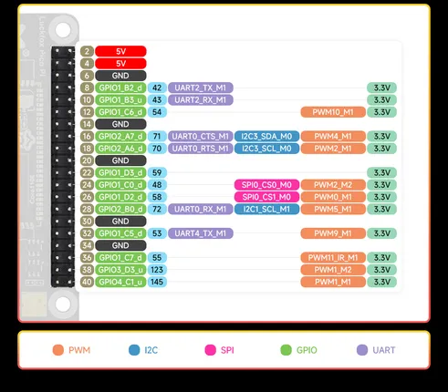
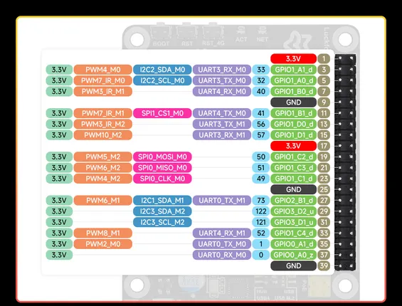

# Luckfox Pico Pi

**Luckfox** · Other

Revision: Not identified

Coverage: Pinout image collected

[Browse all manufacturers](../../../../BROWSE.md) · [Devices & IoT](../../../../DEVICES.md) · [Open in the browser guide](https://valleytech-black-wire-guide.pages.dev/?board=luckfox-other-pico-pi)

## Datasheets and original documentation

Board datasheet: **not yet recorded**. Visual reference: **available**.

Original manufacturer website still needs identification.

A chip datasheet, schematic and board datasheet have different scopes. Match the exact hardware revision.

[Documentation coverage and remaining gaps](../../../../DOCUMENTATION.md)

## Pinout

**pinout image** · Reviewed source · JPG

[Open original reference](../../../../library/media/eab636ec4f87175be930465590ac42c3b22865c1923537a7194b226dda6b15e5.jpg)

**Credit and rights:** Not recorded; retain original attribution. Source/manufacturer: Luckfox.

[Source 1](https://www.waveshare.com/img/devkit/Luckfox-Pico-Pi-A/Luckfox-Pico-Pi-A-details-inter-2.jpg) · [Source 2](https://www.waveshare.com/luckfox-pico-pi.htm)

Image revision: Not identified

SHA-256: `eab636ec4f87175be930465590ac42c3b22865c1923537a7194b226dda6b15e5`

## Pinout

**pinout image** · Reviewed source · JPG

[Open original reference](../../../../library/media/aa946b30af44ad09bbb7fb7c2c5faed59e4f1c1f294c1ba8a93fa8668566ec8e.jpg)

**Credit and rights:** Not recorded; retain original attribution. Source/manufacturer: Luckfox.

[Source 1](https://www.waveshare.com/img/devkit/Luckfox-Pico-Pi-A/Luckfox-Pico-Pi-A-details-inter-1.jpg) · [Source 2](https://www.waveshare.com/luckfox-pico-pi.htm)

Image revision: Not identified

SHA-256: `aa946b30af44ad09bbb7fb7c2c5faed59e4f1c1f294c1ba8a93fa8668566ec8e`

Pin assignments have not been independently electrically verified. Check board revision before wiring.
