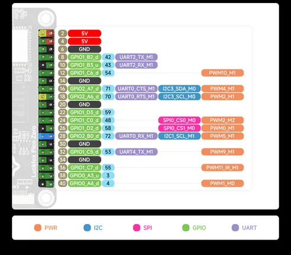
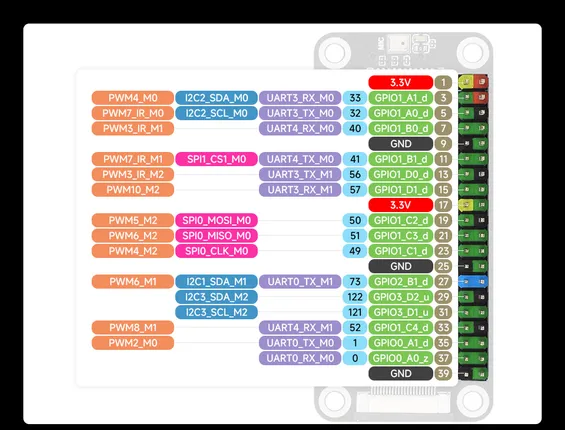

# Luckfox Pico Zero

**Luckfox** · Other

Revision: Not identified  
Coverage: Pinout image collected

[Browse all manufacturers](../../../../BROWSE.md) · [Desktop app](https://github.com/valleytechsolutions/black-wire-desktop)

## Pinout

**pinout image** · Reviewed source · JPG

[Open original reference](../../../../library/media/7ea88d4f4939018993deaab97574c00267ac87dff549d01a839d4461000d2d41.jpg)

**Credit and rights:** Not recorded; retain original attribution. Source/manufacturer: Luckfox.

[Source 1](https://www.waveshare.com/img/devkit/Luckfox-Pico-Zero/Luckfox-Pico-Zero-details-inter2.jpg) · [Source 2](https://www.waveshare.com/luckfox-pico-zero.htm)

SHA-256: `7ea88d4f4939018993deaab97574c00267ac87dff549d01a839d4461000d2d41`

## Pinout

**pinout image** · Reviewed source · JPG

[Open original reference](../../../../library/media/890280c313f7b936f59dfc704db24f07b2af4dc4554d9a127a4e3cb1a2f10f4b.jpg)

**Credit and rights:** Not recorded; retain original attribution. Source/manufacturer: Luckfox.

[Source 1](https://www.waveshare.com/img/devkit/Luckfox-Pico-Zero/Luckfox-Pico-Zero-details-inter1.jpg) · [Source 2](https://www.waveshare.com/luckfox-pico-zero.htm)

SHA-256: `890280c313f7b936f59dfc704db24f07b2af4dc4554d9a127a4e3cb1a2f10f4b`

Pin assignments have not been independently electrically verified. Check board revision before wiring.
