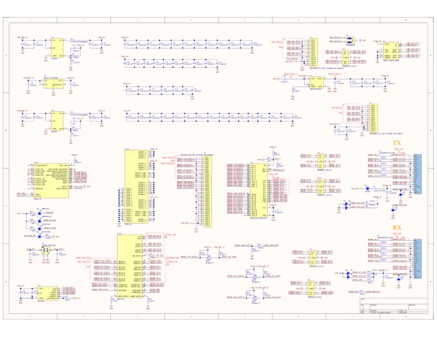

# AI Pyramid-Pro

**M5Stack** · Axera AX8850

Revision: Match revision in each original source

Coverage: Manufacturer references reviewed by scope; independent electrical and all-connector review pending

[Browse all manufacturers](../../../../BROWSE.md) · [Devices & IoT](../../../../DEVICES.md) · [Open in the browser guide](https://valleytech-black-wire-guide.pages.dev/?board=m5stack-ai-pyramid-pro)

## Datasheets and original documentation

Board datasheet: **not yet recorded**. Visual reference: **available**.

[Manufacturer hardware documentation](https://docs.m5stack.com/en/ai_hardware/AI_Pyramid-Pro)

- **schematic / board**: [AI Pyramid-Pro Schematics PDF](https://m5stack-doc.oss-cn-shenzhen.aliyuncs.com/1216/AI-003-AI_Pyramid_PRJ_MAIN_V0.2_20251117_2026_01_30_16_54_30.pdf) · [saved document](../../../../library/media/02e6b4eb94e91ebee6a7e23c2d5d3237d9e84aa5f4a7804153be30b22e59597a.pdf)
- **schematic / board**: [AI Pyramid-Pro PCB Key Schematics PDF](https://m5stack-doc.oss-cn-shenzhen.aliyuncs.com/1216/AI-003-AI_Pyramid_PCB_KEY_V0.2_2026_01_30_16_52_44.pdf) · [saved document](../../../../library/media/e6dadc5501d4f7149fe3f3c06caddfa8c4f1aa594167ab21992c70b3855ac3b3.pdf)
- **schematic / board**: [AI Pyramid-Pro HDMI Schematics PDF](https://m5stack-doc.oss-cn-shenzhen.aliyuncs.com/1216/M5_AI_Pyramid-Pro_PCB_HDMI_THROUGH.pdf) · [saved document](../../../../library/media/b7edd2e57275f8f36af5b1464c33709af009c515837c50b009ae8729a697af92.pdf)
- **hardware-guide / board**: [Manufacturer pin and hardware documentation](https://docs.m5stack.com/en/ai_hardware/AI_Pyramid-Pro) · online

A chip datasheet, schematic and board datasheet have different scopes. Match the exact hardware revision.

[Documentation coverage and remaining gaps](../../../../DOCUMENTATION.md)

## AI Pyramid-Pro Schematics PDF

**original reference PDF** · Source identity and visual scope inspected; PDF review covers first-page preview. Independent electrical and all-connector completeness review pending. · PDF

[Open original reference](../../../../library/media/02e6b4eb94e91ebee6a7e23c2d5d3237d9e84aa5f4a7804153be30b22e59597a.pdf)

**Credit and rights:** Manufacturer artwork; reuse and print rights not established. Inclusion does not relicense the original.. Source/manufacturer: M5Stack.

[Source 1](https://m5stack-doc.oss-cn-shenzhen.aliyuncs.com/1216/AI-003-AI_Pyramid_PRJ_MAIN_V0.2_20251117_2026_01_30_16_54_30.pdf) · [Source 2](https://docs.m5stack.com/en/ai_hardware/AI_Pyramid-Pro)

Manufacturer source retained unchanged. Source identity and visual scope inspected; PDF review covers first-page preview. Independent electrical and all-connector completeness review pending.

Image revision: As supplied in the original; match exact board revision

SHA-256: `02e6b4eb94e91ebee6a7e23c2d5d3237d9e84aa5f4a7804153be30b22e59597a`

## AI Pyramid-Pro PCB Key Schematics PDF

**original reference PDF** · Source identity and visual scope inspected; PDF review covers first-page preview. Independent electrical and all-connector completeness review pending. · PDF

[Open original reference](../../../../library/media/e6dadc5501d4f7149fe3f3c06caddfa8c4f1aa594167ab21992c70b3855ac3b3.pdf)

**Credit and rights:** Manufacturer artwork; reuse and print rights not established. Inclusion does not relicense the original.. Source/manufacturer: M5Stack.

[Source 1](https://m5stack-doc.oss-cn-shenzhen.aliyuncs.com/1216/AI-003-AI_Pyramid_PCB_KEY_V0.2_2026_01_30_16_52_44.pdf) · [Source 2](https://docs.m5stack.com/en/ai_hardware/AI_Pyramid-Pro)

Manufacturer source retained unchanged. Source identity and visual scope inspected; PDF review covers first-page preview. Independent electrical and all-connector completeness review pending.

Image revision: As supplied in the original; match exact board revision

SHA-256: `e6dadc5501d4f7149fe3f3c06caddfa8c4f1aa594167ab21992c70b3855ac3b3`

## AI Pyramid-Pro HDMI Schematics PDF

**original reference PDF** · Source identity and visual scope inspected; PDF review covers first-page preview. Independent electrical and all-connector completeness review pending. · PDF

[Open original reference](../../../../library/media/b7edd2e57275f8f36af5b1464c33709af009c515837c50b009ae8729a697af92.pdf)

**Credit and rights:** Manufacturer artwork; reuse and print rights not established. Inclusion does not relicense the original.. Source/manufacturer: M5Stack.

[Source 1](https://m5stack-doc.oss-cn-shenzhen.aliyuncs.com/1216/M5_AI_Pyramid-Pro_PCB_HDMI_THROUGH.pdf) · [Source 2](https://docs.m5stack.com/en/ai_hardware/AI_Pyramid-Pro)

Manufacturer source retained unchanged. Source identity and visual scope inspected; PDF review covers first-page preview. Independent electrical and all-connector completeness review pending.

Image revision: As supplied in the original; match exact board revision

SHA-256: `b7edd2e57275f8f36af5b1464c33709af009c515837c50b009ae8729a697af92`

Pin assignments have not been independently electrically verified. Check board revision before wiring.
