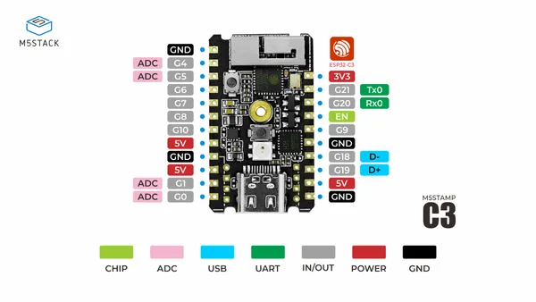

# M5Stamp C3

**M5Stack** · ESP32-C3

Revision: Not identified  
Coverage: Pinout image collected

[Browse all manufacturers](../../../../BROWSE.md) · [Desktop app](https://github.com/valleytechsolutions/black-wire-desktop)

## Physical board pinout

**pinout image** · Reviewed source · JPG

[Open original reference](../../../../library/media/f3e857e16971f20b9aea3330d7507145bbeeba484dc640a496f31bc477ba5ab1.jpg)

**Credit and rights:** Not established; source attribution retained. Source/manufacturer: M5Stack.

[Source 1](https://m5stack-doc.oss-cn-shenzhen.aliyuncs.com/524/C056-B_PinMap_01.jpg) · [Source 2](https://docs.m5stack.com/en/core/stamp_c3)

Discovered from CircuitPython board metadata and the linked product/documentation page. Exact hardware revision requires matching to the diagram.

SHA-256: `f3e857e16971f20b9aea3330d7507145bbeeba484dc640a496f31bc477ba5ab1`

Pin assignments have not been independently electrically verified. Check board revision before wiring.
