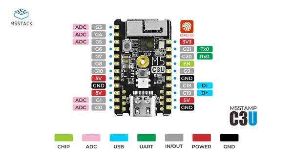

# Stamp-C3U

**M5Stack** · ESP32-C3

Revision: Not identified  
Coverage: Pinout image collected

[Browse all manufacturers](../../../../BROWSE.md) · [Desktop app](https://github.com/valleytechsolutions/black-wire-desktop)

## Pinout

**pinout image** · Reviewed source · JPG

[Open original reference](../../../../library/media/16e91b56e6bc62729ace2f4d9856f2a90f19de004ce15a96b050c596037e1f96.jpg)

**Credit and rights:** Not established; source attribution retained. Source/manufacturer: M5Stack.

[Source 1](https://m5stack-doc.oss-cn-shenzhen.aliyuncs.com/525/C122-B_PinMap_01.jpg) · [Source 2](https://docs.m5stack.com/en/core/stamp_c3u)

Imported from existing M5Stack Board Reference; original working path preserved.

SHA-256: `16e91b56e6bc62729ace2f4d9856f2a90f19de004ce15a96b050c596037e1f96`

Pin assignments have not been independently electrically verified. Check board revision before wiring.
