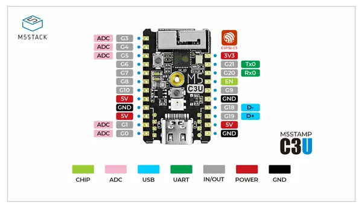

# Stamp-C3U Mate

**M5Stack** · ESP32-C3

Revision: Not identified  
Coverage: Pinout image collected

[Browse all manufacturers](../../../../BROWSE.md) · [Desktop app](https://github.com/valleytechsolutions/black-wire-desktop)

## Pinout

**pinout image** · Reviewed source · PNG

[Open original reference](../../../../library/media/390819bbe88c146e03270eeada7a806f3af71efbe4f9ea2620b73ad3fb0bcf7c.png)

**Credit and rights:** Not established; source attribution retained. Source/manufacturer: M5Stack.

[Source 1](https://static-cdn.m5stack.com/resource/docs/products/core/stamp_c3u/stamp_c3u_09.webp) · [Source 2](https://docs.m5stack.com/en/core/stamp_c3u_mate)

Imported from existing M5Stack Board Reference; original working path preserved.

SHA-256: `390819bbe88c146e03270eeada7a806f3af71efbe4f9ea2620b73ad3fb0bcf7c`

Pin assignments have not been independently electrically verified. Check board revision before wiring.
