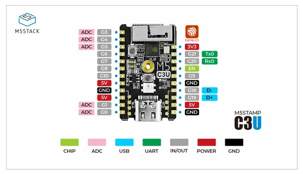

# Stamp-C3U Mate

**M5Stack** · ESP32-C3

Revision: Not identified

Coverage: Pinout image collected

[Browse all manufacturers](../../../../BROWSE.md) · [Devices & IoT](../../../../DEVICES.md) · [Open in the browser guide](https://valleytech-black-wire-guide.pages.dev/?board=m5stack-esp32-stamp-c3u-mate)

## Datasheets and original documentation

Board datasheet: **not yet recorded**. Visual reference: **available**.

[Manufacturer source (recorded link)](https://docs.m5stack.com/en/core/stamp_c3u_mate)

A chip datasheet, schematic and board datasheet have different scopes. Match the exact hardware revision.

[Documentation coverage and remaining gaps](../../../../DOCUMENTATION.md)

## Pinout

**pinout image** · Reviewed source · PNG

[Open original reference](../../../../library/media/390819bbe88c146e03270eeada7a806f3af71efbe4f9ea2620b73ad3fb0bcf7c.png)

**Credit and rights:** Not established; source attribution retained. Source/manufacturer: M5Stack.

[Source 1](https://static-cdn.m5stack.com/resource/docs/products/core/stamp_c3u/stamp_c3u_09.webp) · [Source 2](https://docs.m5stack.com/en/core/stamp_c3u_mate)

Imported from existing M5Stack Board Reference; original working path preserved.

Image revision: Not identified

SHA-256: `390819bbe88c146e03270eeada7a806f3af71efbe4f9ea2620b73ad3fb0bcf7c`

Pin assignments have not been independently electrically verified. Check board revision before wiring.
