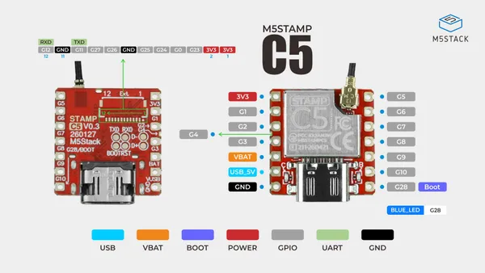
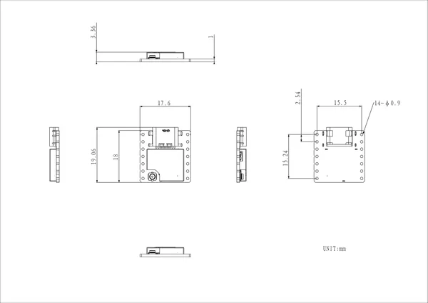

# Stamp-C5

**M5Stack** · ESP32-C5

Revision: Not identified  
Coverage: Pinout image collected

[Browse all manufacturers](../../../../BROWSE.md) · [Desktop app](https://github.com/valleytechsolutions/black-wire-desktop)

## Board pinout

**pinout image** · Reviewed source · JPG

[Open original reference](../../../../library/media/0436f93598621571844b245dc3ba8d6f408e5734f339f28f8c458ac6edb9d26d.jpg)

**Credit and rights:** Not established; source attribution retained. Source/manufacturer: M5Stack.

[Source 1](https://m5stack-doc.oss-cn-shenzhen.aliyuncs.com/1258/S016-Stamp-C5-Pinmap.jpg) · [Source 2](https://docs.m5stack.com/en/core/Stamp-C5)

SHA-256: `0436f93598621571844b245dc3ba8d6f408e5734f339f28f8c458ac6edb9d26d`

## Dimensions

**source reference** · Unreviewed source · PNG

[Open original reference](../../../../library/media/a0dc29b0d1c96f04264bfed3bf7dd3865937d5f3a512117b7cd7e67197950453.png)

**Credit and rights:** Source rights not yet established. Source/manufacturer: M5Stack.

[Source 1](https://m5stack-doc.oss-cn-shenzhen.aliyuncs.com/1258/S016-Stamp-C5_model_size_page_01.png) · [Source 2](https://docs.m5stack.com/en/core/Stamp-C5)

Original source index: Dimensions. This file is searchable but has not been promoted to a reviewed physical board pinout.

SHA-256: `a0dc29b0d1c96f04264bfed3bf7dd3865937d5f3a512117b7cd7e67197950453`

Pin assignments have not been independently electrically verified. Check board revision before wiring.
