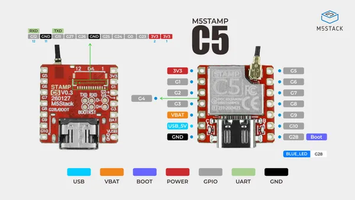
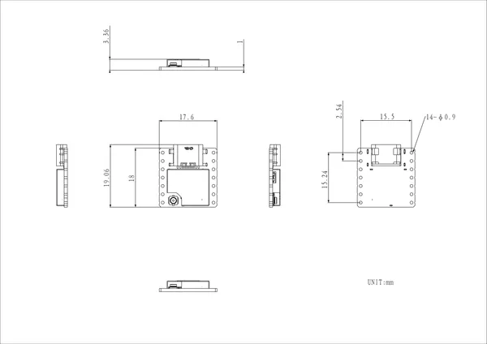

# Stamp-C5

**M5Stack** · ESP32-C5

Revision: Not identified

Coverage: Manufacturer references reviewed by scope; independent electrical and all-connector review pending

[Browse all manufacturers](../../../../BROWSE.md) · [Devices & IoT](../../../../DEVICES.md) · [Open in the browser guide](https://valleytech-black-wire-guide.pages.dev/?board=m5stack-esp32-stamp-c5)

## Datasheets and original documentation

Board datasheet: **not yet recorded**. Visual reference: **available**.

[Manufacturer hardware documentation](https://docs.m5stack.com/en/core/Stamp-C5)

- **schematic / board**: [Stamp-C5 Schematics PDF](https://m5stack-doc.oss-cn-shenzhen.aliyuncs.com/1258/S016_StampC5_V0.3_SCH_PDF_20260207_2026_02_07_11_34_57.pdf) · [saved document](../../../../library/media/3c1501f9dcf4304fec4eeae1bf478ec826546b016922727ad9563030736cebf3.pdf)
- **hardware-guide / board**: [Manufacturer pin and hardware documentation](https://docs.m5stack.com/en/core/Stamp-C5) · online

A chip datasheet, schematic and board datasheet have different scopes. Match the exact hardware revision.

[Documentation coverage and remaining gaps](../../../../DOCUMENTATION.md)

## Board pinout

**pinout image** · Reviewed source · JPG

[Open original reference](../../../../library/media/0436f93598621571844b245dc3ba8d6f408e5734f339f28f8c458ac6edb9d26d.jpg)

**Credit and rights:** Not established; source attribution retained. Source/manufacturer: M5Stack.

[Source 1](https://m5stack-doc.oss-cn-shenzhen.aliyuncs.com/1258/S016-Stamp-C5-Pinmap.jpg) · [Source 2](https://docs.m5stack.com/en/core/Stamp-C5)

Image revision: Not identified

SHA-256: `0436f93598621571844b245dc3ba8d6f408e5734f339f28f8c458ac6edb9d26d`

## Dimensions

**source reference** · Unreviewed source · PNG

[Open original reference](../../../../library/media/a0dc29b0d1c96f04264bfed3bf7dd3865937d5f3a512117b7cd7e67197950453.png)

**Credit and rights:** Source rights not yet established. Source/manufacturer: M5Stack.

[Source 1](https://m5stack-doc.oss-cn-shenzhen.aliyuncs.com/1258/S016-Stamp-C5_model_size_page_01.png) · [Source 2](https://docs.m5stack.com/en/core/Stamp-C5)

Original source index: Dimensions. This file is searchable but has not been promoted to a reviewed physical board pinout.

Image revision: Not identified

SHA-256: `a0dc29b0d1c96f04264bfed3bf7dd3865937d5f3a512117b7cd7e67197950453`

## Stamp-C5 Schematics PDF

**original reference PDF** · Manufacturer source and first-page preview inspected; independent electrical and all-connector completeness review pending. · PDF

[Open original reference](../../../../library/media/3c1501f9dcf4304fec4eeae1bf478ec826546b016922727ad9563030736cebf3.pdf)

**Credit and rights:** Manufacturer artwork; reuse and print rights not established. Inclusion does not relicense the original.. Source/manufacturer: M5Stack.

[Source 1](https://m5stack-doc.oss-cn-shenzhen.aliyuncs.com/1258/S016_StampC5_V0.3_SCH_PDF_20260207_2026_02_07_11_34_57.pdf) · [Source 2](https://docs.m5stack.com/en/core/Stamp-C5)

Manufacturer source retained unchanged. Manufacturer source and first-page preview inspected; independent electrical and all-connector completeness review pending.

Image revision: As supplied in the original; match exact board revision

SHA-256: `3c1501f9dcf4304fec4eeae1bf478ec826546b016922727ad9563030736cebf3`

Pin assignments have not been independently electrically verified. Check board revision before wiring.
