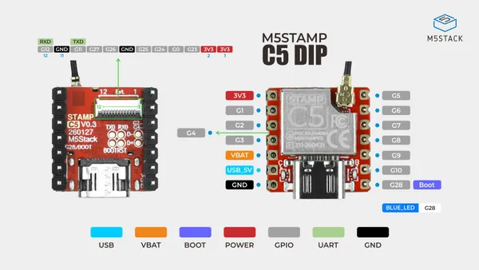
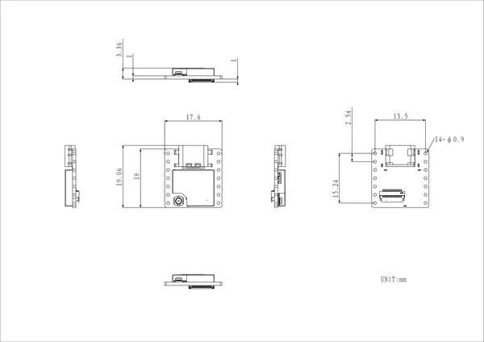

# Stamp-C5 DIP

**M5Stack** · ESP32-C5

Revision: Not identified  
Coverage: Pinout image collected

[Browse all manufacturers](../../../../BROWSE.md) · [Desktop app](https://github.com/valleytechsolutions/black-wire-desktop)

## Board pinout

**pinout image** · Reviewed source · JPG

[Open original reference](../../../../library/media/d0852ba7bd676a7dc16a345304fc06aac749a7c6a5adb33e1cbcd06fcb6f86ff.jpg)

**Credit and rights:** Not established; source attribution retained. Source/manufacturer: M5Stack.

[Source 1](https://m5stack-doc.oss-cn-shenzhen.aliyuncs.com/1259/S016-DIP-Stamp-C5_DIP-Pinmap.jpg) · [Source 2](https://docs.m5stack.com/en/core/Stamp-C5_DIP)

SHA-256: `d0852ba7bd676a7dc16a345304fc06aac749a7c6a5adb33e1cbcd06fcb6f86ff`

## Dimensions

**source reference** · Unreviewed source · PNG

[Open original reference](../../../../library/media/85b8cf19684dbbb87d06e72ba6ca2d199d097b05b797d245fb8131eebe747848.png)

**Credit and rights:** Source rights not yet established. Source/manufacturer: M5Stack.

[Source 1](https://m5stack-doc.oss-cn-shenzhen.aliyuncs.com/1259/S016-DIP-Stamp-C5_DIP_model_size.png) · [Source 2](https://docs.m5stack.com/en/core/Stamp-C5_DIP)

Original source index: Dimensions. This file is searchable but has not been promoted to a reviewed physical board pinout.

SHA-256: `85b8cf19684dbbb87d06e72ba6ca2d199d097b05b797d245fb8131eebe747848`

Pin assignments have not been independently electrically verified. Check board revision before wiring.
