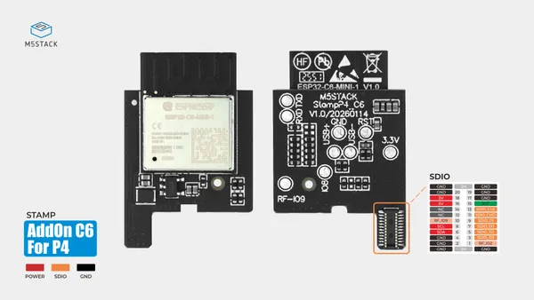
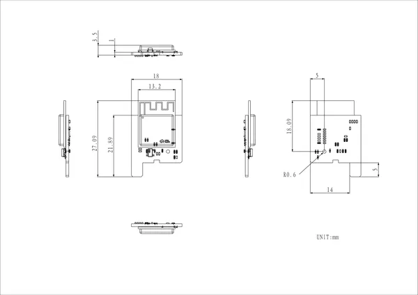

# Stamp-AddOn C6 For P4

**M5Stack** · ESP32-C6

Revision: Not identified  
Coverage: Pinout image collected

[Browse all manufacturers](../../../../BROWSE.md) · [Desktop app](https://github.com/valleytechsolutions/black-wire-desktop)

## Pinout

**pinout image** · Reviewed source · JPG

[Open original reference](../../../../library/media/6cfb7173cd2454ede77c397fa7e71dffa4bbb433b27663a7a173ee97f4b6e6e1.jpg)

**Credit and rights:** Not established; source attribution retained. Source/manufacturer: M5Stack.

[Source 1](https://m5stack-doc.oss-cn-shenzhen.aliyuncs.com/1220/C6_FOR_P4-pinmap.jpg) · [Source 2](https://docs.m5stack.com/en/stamp/Stamp-AddOn_C6_For_P4)

Imported from existing M5Stack Board Reference; original working path preserved.

SHA-256: `6cfb7173cd2454ede77c397fa7e71dffa4bbb433b27663a7a173ee97f4b6e6e1`

## Dimensions

**source reference** · Unreviewed source · PNG

[Open original reference](../../../../library/media/546cd7f412f2fea548e355a500cc853569908aaca2042ec241f8b81f2483184d.png)

**Credit and rights:** Source rights not yet established. Source/manufacturer: M5Stack.

[Source 1](https://m5stack-doc.oss-cn-shenzhen.aliyuncs.com/1220/A172_model-size-stampaddonc6forp4_page_01.png) · [Source 2](https://docs.m5stack.com/en/stamp/Stamp-AddOn_C6_For_P4)

Original source index: Dimensions. This file is searchable but has not been promoted to a reviewed physical board pinout.

SHA-256: `546cd7f412f2fea548e355a500cc853569908aaca2042ec241f8b81f2483184d`

Pin assignments have not been independently electrically verified. Check board revision before wiring.
