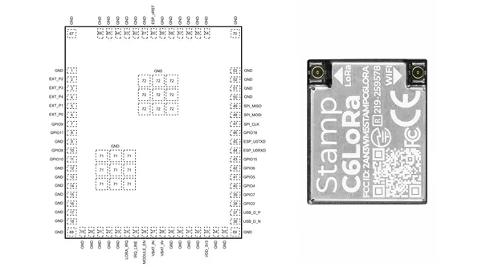
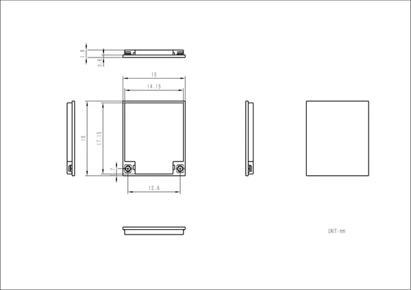

# Stamp C6LoRa

**M5Stack** · ESP32-C6

Revision: Not identified  
Coverage: Pinout image collected

[Browse all manufacturers](../../../../BROWSE.md) · [Desktop app](https://github.com/valleytechsolutions/black-wire-desktop)

## Pinout

**pinout image** · Reviewed source · PNG

[Open original reference](../../../../library/media/c722f16e3e3e02640facb8ae68911494ccb6e94cf6bebbf730bff721d401d643.png)

**Credit and rights:** Not established; source attribution retained. Source/manufacturer: M5Stack.

[Source 1](https://m5stack-doc.oss-cn-shenzhen.aliyuncs.com/1223/S012-stamp-c6lora-pin-map-pic.png) · [Source 2](https://docs.m5stack.com/en/core/Stamp_C6LoRa)

Imported from existing M5Stack Board Reference; original working path preserved.

SHA-256: `c722f16e3e3e02640facb8ae68911494ccb6e94cf6bebbf730bff721d401d643`

## Dimensions

**source reference** · Unreviewed source · PNG

[Open original reference](../../../../library/media/babd79e909c4c9435cb78eefaf38bc1019bf7d99d900ff038ee03c265da5d859.png)

**Credit and rights:** Source rights not yet established. Source/manufacturer: M5Stack.

[Source 1](https://m5stack-doc.oss-cn-shenzhen.aliyuncs.com/1223/S012_Stamp_C6LoRa_model_size_page_01.png) · [Source 2](https://docs.m5stack.com/en/core/Stamp_C6LoRa)

Original source index: Dimensions. This file is searchable but has not been promoted to a reviewed physical board pinout.

SHA-256: `babd79e909c4c9435cb78eefaf38bc1019bf7d99d900ff038ee03c265da5d859`

Pin assignments have not been independently electrically verified. Check board revision before wiring.
