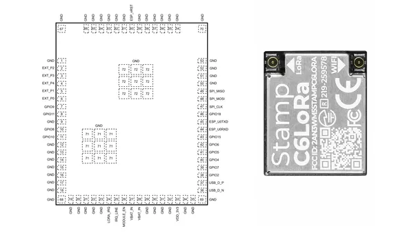
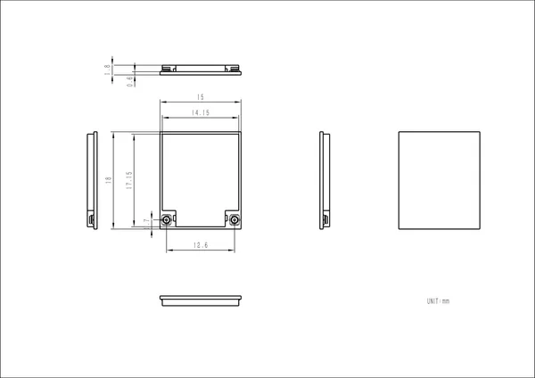
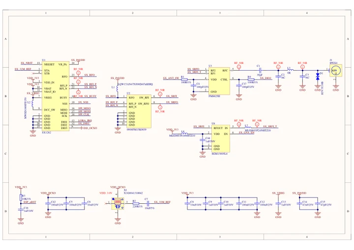

# Stamp C6LoRa

**M5Stack** · ESP32-C6

Revision: Not identified

Coverage: Manufacturer references reviewed by scope; independent electrical and all-connector review pending

[Browse all manufacturers](../../../../BROWSE.md) · [Devices & IoT](../../../../DEVICES.md) · [Open in the browser guide](https://valleytech-black-wire-guide.pages.dev/?board=m5stack-esp32-stamp-c6lora)

## Datasheets and original documentation

Board datasheet: **not yet recorded**. Visual reference: **available**.

[Manufacturer hardware documentation](https://docs.m5stack.com/en/core/Stamp_C6LoRa)

- **schematic / board**: [Stamp C6LoRa Schematics PDF](https://m5stack-doc.oss-cn-shenzhen.aliyuncs.com/1223/S012-SCH_Sch_M5_C6_Lora_v0.2.3_2025_12_02_19_14_35.pdf) · [saved document](../../../../library/media/2dafe92c5090a01aa948c1ce88b17d1237421d09701c1e0a15a122bd9d844d35.pdf)
- **hardware-guide / board**: [Manufacturer pin and hardware documentation](https://docs.m5stack.com/en/core/Stamp_C6LoRa) · online

A chip datasheet, schematic and board datasheet have different scopes. Match the exact hardware revision.

[Documentation coverage and remaining gaps](../../../../DOCUMENTATION.md)

## Pinout

**pinout image** · Reviewed source · PNG

[Open original reference](../../../../library/media/c722f16e3e3e02640facb8ae68911494ccb6e94cf6bebbf730bff721d401d643.png)

**Credit and rights:** Not established; source attribution retained. Source/manufacturer: M5Stack.

[Source 1](https://m5stack-doc.oss-cn-shenzhen.aliyuncs.com/1223/S012-stamp-c6lora-pin-map-pic.png) · [Source 2](https://docs.m5stack.com/en/core/Stamp_C6LoRa)

Imported from existing M5Stack Board Reference; original working path preserved.

Image revision: Not identified

SHA-256: `c722f16e3e3e02640facb8ae68911494ccb6e94cf6bebbf730bff721d401d643`

## Dimensions

**source reference** · Unreviewed source · PNG

[Open original reference](../../../../library/media/babd79e909c4c9435cb78eefaf38bc1019bf7d99d900ff038ee03c265da5d859.png)

**Credit and rights:** Source rights not yet established. Source/manufacturer: M5Stack.

[Source 1](https://m5stack-doc.oss-cn-shenzhen.aliyuncs.com/1223/S012_Stamp_C6LoRa_model_size_page_01.png) · [Source 2](https://docs.m5stack.com/en/core/Stamp_C6LoRa)

Original source index: Dimensions. This file is searchable but has not been promoted to a reviewed physical board pinout.

Image revision: Not identified

SHA-256: `babd79e909c4c9435cb78eefaf38bc1019bf7d99d900ff038ee03c265da5d859`

## Stamp C6LoRa Schematics PDF

**original reference PDF** · Manufacturer source and first-page preview inspected; electrical correctness and all-connector completeness not independently approved. · PDF

[Open original reference](../../../../library/media/2dafe92c5090a01aa948c1ce88b17d1237421d09701c1e0a15a122bd9d844d35.pdf)

**Credit and rights:** Manufacturer artwork; reuse and print rights not established. Inclusion does not relicense the original.. Source/manufacturer: M5Stack.

[Source 1](https://m5stack-doc.oss-cn-shenzhen.aliyuncs.com/1223/S012-SCH_Sch_M5_C6_Lora_v0.2.3_2025_12_02_19_14_35.pdf) · [Source 2](https://docs.m5stack.com/en/core/Stamp_C6LoRa)

Manufacturer source retained unchanged. Manufacturer source and first-page preview inspected; electrical correctness and all-connector completeness not independently approved.

Image revision: As supplied in the original; match exact board revision

SHA-256: `2dafe92c5090a01aa948c1ce88b17d1237421d09701c1e0a15a122bd9d844d35`

Pin assignments have not been independently electrically verified. Check board revision before wiring.
