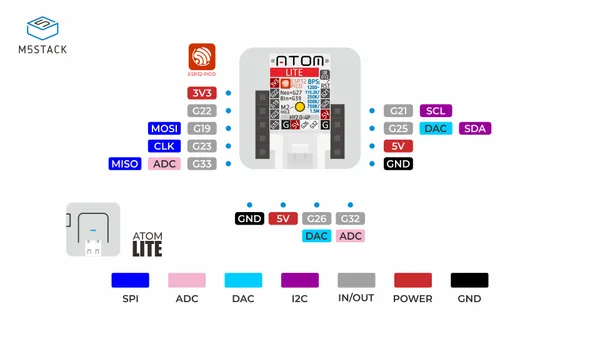

# ATOM Lite ESP32 IoT

**M5Stack** · ESP32 original

Revision: Not identified  
Coverage: Pinout image collected

[Browse all manufacturers](../../../../BROWSE.md) · [Devices & IoT](../../../../DEVICES.md) · [Open in the browser guide](https://valleytech-black-wire-guide.pages.dev/?board=m5stack-esp32-atom-lite-esp32-iot)

Device category: **Controllers & instruments**

## Physical board pinout

**pinout image** · Reviewed source · JPG

[Open original reference](../../../../library/media/c560ae52e54a7bf6ed5c0b990a0ab89a1e2f41c220798f03aa412b4ae7efa6c3.jpg)

**Credit and rights:** Not established; source attribution retained. Source/manufacturer: M5Stack.

[Source 1](https://m5stack-doc.oss-cn-shenzhen.aliyuncs.com/673/C008_PinMap_01.jpg) · [Source 2](https://docs.m5stack.com/en/core/ATOM%20Lite)

Discovered from CircuitPython board metadata and the linked product/documentation page. Exact hardware revision requires matching to the diagram.

Image revision: Not identified

SHA-256: `c560ae52e54a7bf6ed5c0b990a0ab89a1e2f41c220798f03aa412b4ae7efa6c3`

Pin assignments have not been independently electrically verified. Check board revision before wiring.
