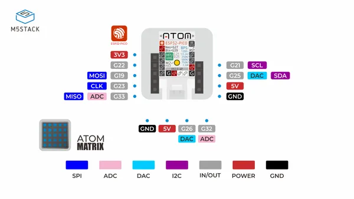

# ATOM Matrix ESP32

**M5Stack** · ESP32 original

Revision: Not identified  
Coverage: Pinout image collected

[Browse all manufacturers](../../../../BROWSE.md) · [Desktop app](https://github.com/valleytechsolutions/black-wire-desktop)

## Physical board pinout

**pinout image** · Reviewed source · JPG

[Open original reference](../../../../library/media/50b58e784ae85243b6c91374311717c43e35b38158859daa51b91246b393a9e1.jpg)

**Credit and rights:** Not established; source attribution retained. Source/manufacturer: M5Stack.

[Source 1](https://cdn-shop.adafruit.com/product-files/4497/P4497+C008-B_PinMap_01.jpg) · [Source 2](https://www.adafruit.com/product/4497)

Discovered from CircuitPython board metadata and the linked product/documentation page. Exact hardware revision requires matching to the diagram.

SHA-256: `50b58e784ae85243b6c91374311717c43e35b38158859daa51b91246b393a9e1`

Pin assignments have not been independently electrically verified. Check board revision before wiring.
