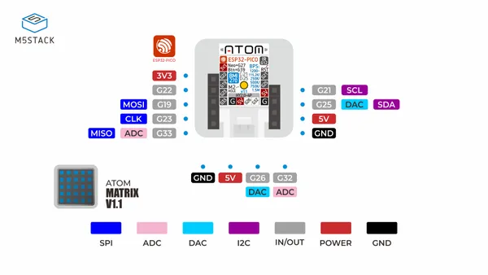

# Atom-Matrix v1.1

**M5Stack** · ESP32 original

Revision: Not identified

Coverage: Pinout image collected

[Browse all manufacturers](../../../../BROWSE.md) · [Devices & IoT](../../../../DEVICES.md) · [Open in the browser guide](https://valleytech-black-wire-guide.pages.dev/?board=m5stack-gpio-device-atom-matrix-v1-1)

Device category: **Controllers & instruments**

## Datasheets and original documentation

Board datasheet: **not yet recorded**. Visual reference: **available**.

[Manufacturer source (recorded link)](https://docs.m5stack.com/en/core/Atom-Matrix_v1.1)

A chip datasheet, schematic and board datasheet have different scopes. Match the exact hardware revision.

[Documentation coverage and remaining gaps](../../../../DOCUMENTATION.md)

## Pinout

**pinout image** · Reviewed source · JPG

[Open original reference](../../../../library/media/bba6704a0f8a17931ce75d4e4db97a1250d2f6eacef058d27fd850e7ec417cdb.jpg)

**Credit and rights:** Not established; source attribution retained. Source/manufacturer: M5Stack.

[Source 1](https://m5stack-doc.oss-cn-shenzhen.aliyuncs.com/1228/C008-B-V11_PinMap.jpg) · [Source 2](https://docs.m5stack.com/en/core/Atom-Matrix_v1.1)

Imported from existing M5Stack Board Reference; original working path preserved.

Image revision: Not identified

SHA-256: `bba6704a0f8a17931ce75d4e4db97a1250d2f6eacef058d27fd850e7ec417cdb`

Pin assignments have not been independently electrically verified. Check board revision before wiring.
