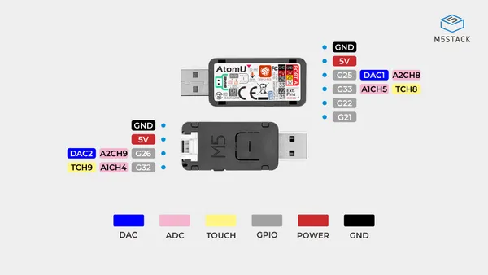

# AtomU

**M5Stack** · ESP32 original

Revision: Not identified  
Coverage: Pinout image collected

[Browse all manufacturers](../../../../BROWSE.md) · [Desktop app](https://github.com/valleytechsolutions/black-wire-desktop)

## Pinout

**pinout image** · Reviewed source · JPG

[Open original reference](../../../../library/media/c7db861a6847f743e1a4c4e4a0ac912e34c70ed16a4b4ccee1c89aef9750025c.jpg)

**Credit and rights:** Not established; source attribution retained. Source/manufacturer: M5Stack.

[Source 1](https://m5stack-doc.oss-cn-shenzhen.aliyuncs.com/675/K117_PinMap_01.jpg) · [Source 2](https://docs.m5stack.com/en/core/ATOM%20U)

Imported from existing M5Stack Board Reference; original working path preserved.

SHA-256: `c7db861a6847f743e1a4c4e4a0ac912e34c70ed16a4b4ccee1c89aef9750025c`

Pin assignments have not been independently electrically verified. Check board revision before wiring.
