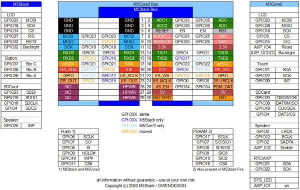
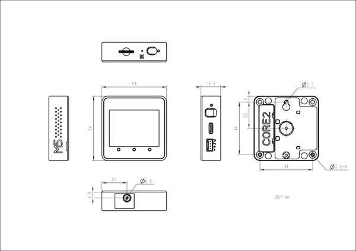

# Core2

**M5Stack** · ESP32 original

Revision: Not identified  
Coverage: GPIO reference collected; physical pinout needed

[Browse all manufacturers](../../../../BROWSE.md) · [Desktop app](https://github.com/valleytechsolutions/black-wire-desktop)

## Pinout

**GPIO reference image** · Reviewed source · PNG

[Open original reference](../../../../library/media/31abfdb0fd464a87fd03e0cd0c713fec83d3b550f3b4958eccbc3123a3b8de6f.png)

**Credit and rights:** Not established; source attribution retained. Source/manufacturer: M5Stack.

[Source 1](https://www.gwendesign.com/kb/m5stack/img/M5StackM5Core2GPIO.png) · [Source 2](https://docs.m5stack.com/en/core/core2)

Imported from existing M5Stack Board Reference; original working path preserved.

SHA-256: `31abfdb0fd464a87fd03e0cd0c713fec83d3b550f3b4958eccbc3123a3b8de6f`

## Dimensions

**source reference** · Unreviewed source · JPG

[Open original reference](../../../../library/media/3e20685bc8d203c5380e4ce97c72475059d89a89c6785ebd77af87c1ef546b1b.jpg)

**Credit and rights:** Source rights not yet established. Source/manufacturer: M5Stack.

[Source 1](https://m5stack.oss-cn-shenzhen.aliyuncs.com/resource/docs/products/core/core2/%E5%B0%BA%E5%AF%B8%E5%9B%BE.jpg) · [Source 2](https://docs.m5stack.com/en/core/core2)

Original source index: Dimensions. This file is searchable but has not been promoted to a reviewed physical board pinout.

SHA-256: `3e20685bc8d203c5380e4ce97c72475059d89a89c6785ebd77af87c1ef546b1b`

Pin assignments have not been independently electrically verified. Check board revision before wiring.
