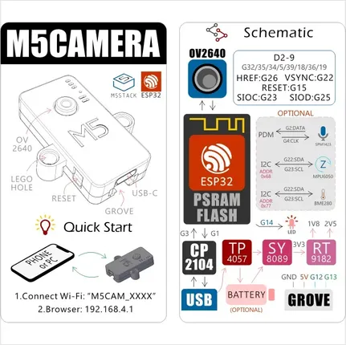

# M5Camera

**M5Stack** · ESP32 original

Revision: Not identified  
Coverage: GPIO reference collected; physical pinout needed

[Browse all manufacturers](../../../../BROWSE.md) · [Desktop app](https://github.com/valleytechsolutions/black-wire-desktop)

## Pinout

**GPIO reference image** · Reviewed source · PNG

[Open original reference](../../../../library/media/6ec43f1218a4c3228d39491146a5f324f87f940c976ee8ff52d8d5a3b4e3a3cb.png)

**Credit and rights:** Not established; source attribution retained. Source/manufacturer: M5Stack.

[Source 1](https://static-cdn.m5stack.com/resource/docs/products/unit/m5camera/m5camera_04.webp) · [Source 2](https://docs.m5stack.com/en/unit/m5camera)

Imported from existing M5Stack Board Reference; original working path preserved.

SHA-256: `6ec43f1218a4c3228d39491146a5f324f87f940c976ee8ff52d8d5a3b4e3a3cb`

Pin assignments have not been independently electrically verified. Check board revision before wiring.
