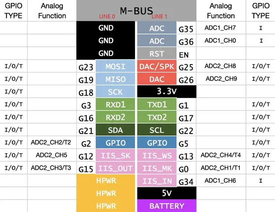

# M5GO-Lite

**M5Stack** · ESP32 original

Revision: Not identified  
Coverage: GPIO reference collected; physical pinout needed

[Browse all manufacturers](../../../../BROWSE.md) · [Devices & IoT](../../../../DEVICES.md) · [Open in the browser guide](https://valleytech-black-wire-guide.pages.dev/?board=m5stack-gpio-device-m5go-lite)

Device category: **Controllers & instruments**

## Pinout

**GPIO reference image** · Reviewed source · PNG

[Open original reference](../../../../library/media/1d56ae18bba4846fa50bdbeb8e114e57de55f0adedf32fc68b32176828283ec0.png)

**Credit and rights:** Not established; source attribution retained. Source/manufacturer: M5Stack.

[Source 1](https://static-cdn.m5stack.com/resource/docs/products/core/common/core1_mbus.webp) · [Source 2](https://docs.m5stack.com/en/core/m5go_lite)

Imported from existing M5Stack Board Reference; original working path preserved.

Image revision: Not identified

SHA-256: `1d56ae18bba4846fa50bdbeb8e114e57de55f0adedf32fc68b32176828283ec0`

Pin assignments have not been independently electrically verified. Check board revision before wiring.
